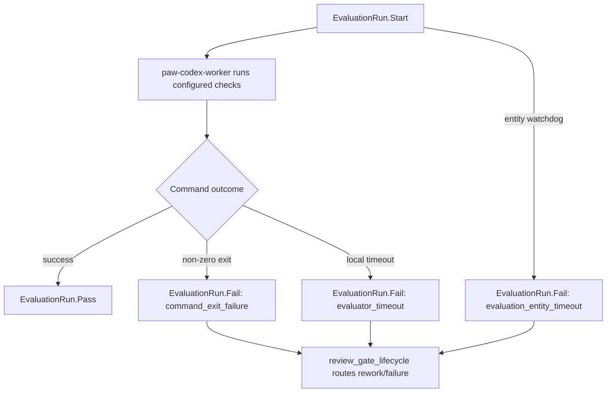

# Proof Report: 068 - Paw Patrol Evaluator Timeout Classification

## Date
2026-05-07

## Scope
Paw Patrol and `paw-codex-worker` only. No Railway image redeploy, no `paw-agent`
or `paw-channels` hot-load, and no Discord transport changes.

## Trigger
The independent reviewer requested a clearer Patrol failure model after a live
evaluation failed. The missing distinction was whether an evaluation failed
because a command exited non-zero, a local evaluator command hung, or the
entity-level watchdog timed out.

## Change
Evaluator shell commands now run inside a local process-group timeout and
report a first-class `failure_classification` to `EvaluationRun.Fail`.



The app-scoped decision is recorded in
`os-apps/paw-patrol/adrs/0002-evaluation-timeout-classification.md`.

## Verification
Local checks:

```text
cargo fmt --check
git diff --check
cargo test -p paw-codex-worker -- --nocapture
cargo test -p temperpaw --test paw_patrol_foundation -- --nocapture
cargo test -p temperpaw --test datadog_monitor_config -- --nocapture
os-apps/paw-patrol/wasm/build.sh
npm --prefix dashboard run check
npm --prefix dashboard run build
```

Key regressions:

```text
evaluation_commands_classify_local_timeouts ... ok
paw_patrol_evaluation_timeout_classification_is_recorded_in_app_adr ... ok
reviewer_and_evaluator_results_gate_completion_before_human_review ... ok
```

Production hot-load, Paw Patrol only:

```text
POST /api/specs/load-inline
entities=["EvaluationRun"]
all_passed=true

POST /api/wasm/modules/review_gate_lifecycle
sha256_hash=ab6544d0fde2d593065093db9d72edbc7c6c05e6f452f19d2ccddfefa0143a00
size_bytes=290475
```

Production health after hot-load:

```json
{
  "status": "ready",
  "discord": {
    "status": "connected",
    "configured": true,
    "connected": true,
    "desired_state": "connected",
    "connection_state": "Connected",
    "last_error": null,
    "next_retry_at": null
  }
}
```

## Residual Risk
The Mac mini worker should be rebuilt and restarted only after its active
low-risk Codex job finishes, so the currently running implementation is not
interrupted.
