# Proof Report: 069 - Datadog Sensitive Follow-up Start Gate

## Date
2026-05-07

## Scope
Paw Patrol `patrol_run_lifecycle` only. No Railway image redeploy, no
`paw-agent` or `paw-channels` hot-load, and no Discord transport changes.

## Trigger
A Datadog follow-up marked as low-risk tried to touch a channel path in its
isolated Mac mini worktree. The worker path guard correctly refused completion,
but Patrol should be more conservative before queueing follow-up code work.

## Change
Datadog Patrol follow-up WorkCycles now require human start approval whenever
the finding text or affected services mention sensitive surfaces:

- `paw-agent`
- `paw-channels`
- `discord`
- `channel` / `transport`
- `railway`
- `deploy` / `deployment`
- `production`
- `secret`
- `cedar`

```mermaid
flowchart TD
    A["PatrolRun.RecordEvidence"] --> B["ObservabilityFinding"]
    B --> C{"Sensitive surface?"}
    C -->|"yes"| D["WorkCycle.RequestHumanStartApproval"]
    C -->|"no"| E["WorkCycle.StartWork"]
    E --> F["WorkerRun local Codex"]
    D --> G["Human approves before any WorkerRun"]
```



## Verification
Local checks:

```text
cargo fmt --check
cargo test -p temperpaw --test paw_patrol_foundation datadog_observability_patrol_run_uses_temper_state_and_creates_work -- --nocapture
cargo test -p paw-codex-worker -- --nocapture
cargo test -p temperpaw --test paw_patrol_foundation -- --nocapture
os-apps/paw-patrol/wasm/build.sh
npm --prefix dashboard run check
npm --prefix dashboard run build
```

Production hot-load, Paw Patrol only:

```text
POST /api/wasm/modules/patrol_run_lifecycle
sha256_hash=f36af67f84d51ab129388ea2f91848ddd15b00e0a30a8b782a57b7c2c91351fb
size_bytes=318972
```

Production health after hot-load:

```json
{
  "status": "ready",
  "discord": {
    "status": "connected",
    "configured": true,
    "connected": true,
    "desired_state": "connected",
    "connection_state": "Connected",
    "last_error": null,
    "next_retry_at": null
  }
}
```

## Live Guard Evidence
Existing already-queued follow-up runs cannot be retroactively unqueued by this
WASM change. The profiler run was refused by `PAW_CODEX_FORBIDDEN_DONE_PATHS`
after changing `os-apps/paw-channels/...`, proving the Mac worker completion
guard is active. New Datadog Patrol fanout now pauses those sensitive follow-up
classes before WorkerRun creation.
