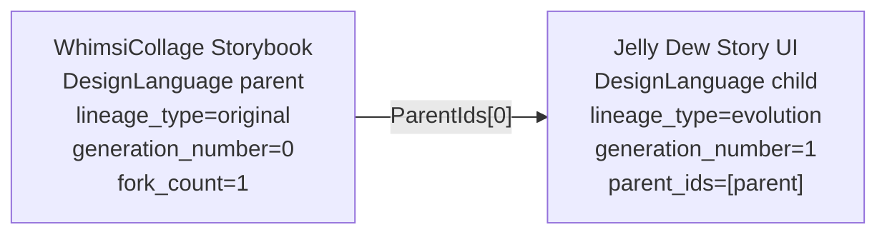
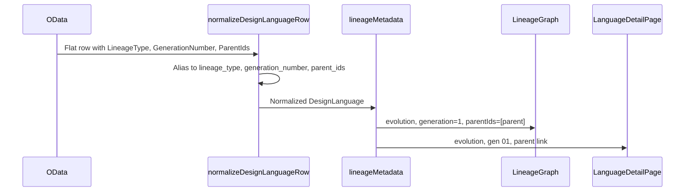

# ProofPacket: Katagami lineage display rework

WorkRequest: `en-019e0b03-dd39-7671-aafe-39bbd1b6836d`
FactoryCase: `en-019e0b03-ed5a-71f1-b00e-f0fb8f47c46b`
WorkCycle: `wc-019e0b03-ee16-7771-bad9-29d40d78e4ed`
Date: 2026-05-09

## Summary

The Katagami UI fix was isolated from unrelated curation/WASM changes, pushed
to the Katagami remote, and opened as a reviewable pull request.

- Katagami worktree:
  `/Users/openclaw/Development/katagami-worktrees/lineage-display`
- Katagami branch: `codex/lineage-display-normalization`
- Katagami remote branch: `origin/codex/lineage-display-normalization`
- Katagami PR: https://github.com/arni-labs/katagami/pull/26
- Katagami implementation commit: `2c130cd`
  (`Fix lineage display normalization`)
- Katagami current PR head: `5bada0b`
  (`Document lineage display PR`)
- TemperPaw assigned branch:
  `codex/paw-patrol-d1b6836d`
- TemperPaw PR: https://github.com/nerdsane/temperpaw/pull/247

The assigned TemperPaw branch carries this proof packet because the UI source
lives in `arni-labs/katagami`, not in the TemperPaw repository. No TemperPaw
runtime, entity spec, WASM integration, Cedar policy, deployment, or secret
files were changed.

## Reviewer Feedback Addressed

Reviewer concern:

> lineage normalization looks directionally correct, but I cannot approve
> because the implementation is uncommitted outside the assigned branch and
> bundled with unproved unrelated WASM/curation changes.

Actions taken:

- Recreated the fix from clean `origin/master` in a separate Katagami worktree.
- Committed only Katagami UI lineage files and proof on branch
  `codex/lineage-display-normalization`.
- Pushed the implementation branch to `origin/codex/lineage-display-normalization`.
- Opened Katagami PR #26:
  https://github.com/arni-labs/katagami/pull/26
- Did not include the unrelated dirty checkout changes from
  `/Users/openclaw/Development/katagami`.
- Added a packaged live E2E script:
  `ui/scripts/check-lineage-display-e2e.mjs`.
- Added a Katagami proof packet:
  `.proofs/024-lineage-display-normalization.md`.
- Rebased the assigned TemperPaw branch onto current `origin/main` so the
  reviewer no longer sees unrelated stacked paw-patrol infrastructure changes.
  Backup ref kept locally:
  `backup/codex-paw-patrol-d1b6836d-before-review-rework`.
- Pushed the assigned TemperPaw branch to
  `origin/codex/paw-patrol-d1b6836d` and opened PR #247:
  https://github.com/nerdsane/temperpaw/pull/247
- Confirmed the assigned TemperPaw review diff now contains only
  `.proofs/070-katagami-lineage-display-rework.md`.

## Changed Files Map

```mermaid
flowchart TD
  A[Katagami PR #26] --> B[ui/src/lib/odata.ts]
  B --> C[normalize flat OData lineage fields]
  B --> D[lineageMetadata + lineageNodesFromLanguages]
  D --> E[ui/src/app/(site)/lineage/page.tsx]
  D --> F[ui/src/app/(site)/language/[id]/page.tsx]
  G[ui/scripts/check-lineage-display.mjs] --> B
  H[ui/scripts/check-lineage-display-e2e.mjs] --> I[mock OData + live Next UI]
  J[ui/package.json] --> G
  J --> H
```

Katagami changed files:

- `.proofs/024-lineage-display-normalization.md`
- `ui/package.json`
- `ui/scripts/check-lineage-display-e2e.mjs`
- `ui/scripts/check-lineage-display.mjs`
- `ui/src/app/(site)/language/[id]/page.tsx`
- `ui/src/app/(site)/lineage/page.tsx`
- `ui/src/lib/odata.ts`

TemperPaw changed files:

- `.proofs/070-katagami-lineage-display-rework.md`

Assigned TemperPaw branch diff after reviewer rework:

```text
$ git diff --stat origin/main...HEAD
 .proofs/070-katagami-lineage-display-rework.md | 251 +++++++++++++++++++++++++
 1 file changed, 251 insertions(+)
```

## Lineage State Diagram



## Render Pipeline



## Red-Green TDD

Red in the clean Katagami worktree:

```text
$ node scripts/check-lineage-display.mjs
TypeError: normalizeDesignLanguageRow is not a function
```

Green:

```text
$ npm run test:lineage
> ui@0.1.0 test:lineage
> node scripts/check-lineage-display.mjs
```

## Verification

Katagami UI checks:

```text
$ npm run test:lineage
> ui@0.1.0 test:lineage
> node scripts/check-lineage-display.mjs

$ npm run test:gallery
> ui@0.1.0 test:gallery
> node scripts/check-gallery-renders-all-cards.mjs

$ npx eslint src/lib/odata.ts 'src/app/(site)/lineage/page.tsx' \
  'src/app/(site)/language/[id]/page.tsx' \
  scripts/check-lineage-display.mjs \
  scripts/check-lineage-display-e2e.mjs
passed with no output

$ npx tsc --noEmit
passed with no output

$ npm run build
> ui@0.1.0 build
> next build
✓ Compiled successfully
✓ Generating static pages using 9 workers (9/9)
```

Packaged live E2E:

```text
$ npm run test:lineage:e2e
> ui@0.1.0 test:lineage:e2e
> node scripts/check-lineage-display-e2e.mjs
E2E lineage display check passed for evolution child and parent link
```

Git state checks:

```text
$ git -C /Users/openclaw/Development/katagami-worktrees/lineage-display status --short --branch
## codex/lineage-display-normalization...origin/codex/lineage-display-normalization

$ gh pr view 26 --repo arni-labs/katagami --json url,state,headRefName,baseRefName
{"baseRefName":"master","headRefName":"codex/lineage-display-normalization","state":"OPEN","url":"https://github.com/arni-labs/katagami/pull/26"}

$ git status --short --branch
## codex/paw-patrol-d1b6836d
```

Full Katagami UI lint:

```text
$ npm run lint
failed on pre-existing unrelated files:
- ui/posters/agent-flow.tsx
- ui/posters/curation-flow.tsx
- ui/scripts/migrate-to-railway.mjs
- ui/src/app/radix-test/page.tsx
- ui/src/components/design-showcase.tsx
- ui/src/components/embodiment-viewer.tsx
- ui/src/components/embodiments/kukan-press-agent.tsx
- ui/src/components/embodiments/kukan-press-radix.tsx
- ui/src/components/embodiments/neo-kawaii-radix.tsx
- ui/src/components/embodiments/neo-kawaii-tech.tsx
- ui/src/components/safe-embodiment-frame.tsx
- ui/src/lib/tsx-runtime.ts
- ui/src/lib/use-theme.ts
```

Assigned TemperPaw worktree check:

```text
$ cargo build --workspace
Finished `dev` profile [unoptimized + debuginfo] target(s) in 29.47s
```

## E2E Evidence

The packaged E2E script starts a local mock Temper OData server and a live Next
dev server. It verifies:

- `/language/en-019e0af5-0d06-7fd1-a21c-ab36e45553b3` renders
  `Jelly Dew Story UI`, `evolution`, `gen 01`, and
  `WhimsiCollage Storybook`.
- `/lineage?root=en-019e0af5-0d06-7fd1-a21c-ab36e45553b3` renders
  `1 evolution`, `gen 01`, `first evolutions`, `Jelly Dew Story UI`, and
  `WhimsiCollage Storybook`.
- The mock OData server receives requests for both child and parent
  DesignLanguage rows.

## OData Links

Expected live OData links:

- Child:
  `http://localhost:3500/tdata/DesignLanguages('en-019e0af5-0d06-7fd1-a21c-ab36e45553b3')`
- Parent:
  `http://localhost:3500/tdata/DesignLanguages('en-019d9bba-3cb4-7072-ab23-7914ed75c93e')`
- List:
  `http://localhost:3500/tdata/DesignLanguages?$top=500`

Packaged mock E2E paths:

- `GET /tdata/DesignLanguages('en-019e0af5-0d06-7fd1-a21c-ab36e45553b3')`
- `GET /tdata/DesignLanguages('en-019d9bba-3cb4-7072-ab23-7914ed75c93e')`
- `GET /tdata/DesignLanguages?$top=500`

## Risk Notes

- Evidence-based risk triage: UI display/data-adapter only.
- No production deployment behavior changed.
- No secrets touched.
- No data migration touched.
- No Cedar policy touched.
- No Temper entity specs touched.
- No WASM integrations touched.
- Existing OData fetches already use `cache: "no-store"`; the defect was
  projection shape normalization, not cache invalidation.
- ADR decision: no ADR added. This is a narrow UI normalization/rendering
  correction in Katagami UI and does not change Temper architecture, entity
  state machines, WASM orchestration, authorization, storage/provenance,
  triggers, deployment, or agent capability surfaces.
