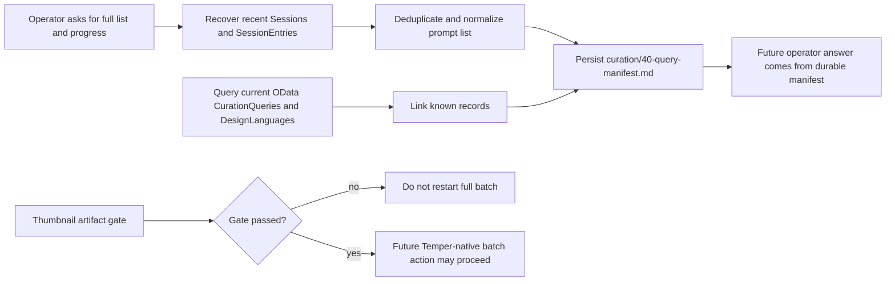

# ProofPacket: Curation Campaign Manifest Recovery

Date: 2026-05-08

WorkRequest: `en-019e088b-830a-79f0-8a20-9d674b896bf0`
FactoryCase: `en-019e088b-8c48-73c3-b49f-611c1c509e5a`
WorkCycle: `wc-019e088b-8cb7-70e2-9b0c-bddafb1f63fe`

## Changed Files Map

| File | Purpose |
| --- | --- |
| `curation/40-query-manifest.md` | Durable manifest for recovered raw campaign prompts, execution progress, entity links, and thumbnail blocker state. |
| `.proofs/2026-05-08-curation-campaign-manifest.md` | Evidence packet for risk triage, recovery sources, validation, and E2E limits. |

## State Diagram



## Risk Triage

This work was treated as low production risk because it only reads production OData/session state and writes local documentation artifacts in the assigned worktree.

No production mutation was performed. No entities were created, no actions were dispatched, no batch was restarted, and no secrets were written to the manifest or proof.

An entity-backed campaign record would be a material architecture change and would require ADR/TDD/E2E work before implementation. This patch intentionally stops at the durable local artifact requested as an acceptable equivalent.

## Red-Green Record

Red test before implementation:

```sh
test -f curation/40-query-manifest.md
```

Result: exited `1`, proving the durable manifest artifact was missing before this change.

Green validation after implementation is recorded in the final validation section below.

## Recovery Evidence

Read-only OData/session inspection found:

- `Sessions('ss-019e0439-ddb8-7080-9a55-7a0f39b2ceef')`: original operator campaign session.
- `SessionEntries` for `ss-019e0439-ddb8-7080-9a55-7a0f39b2ceef`, assistant sequence 1: recovered the 45 raw prompt strings.
- `SessionEntries` for `ss-019e04bc-7489-7912-a338-7367d1a19a48`: recovered batch-one progress and partial later-batch references.
- `Sessions('ss-019e0862-4af6-7582-807b-15742f5e6fc3')`: confirmed later request for the remembered full list/status and failed persisted-memory lookup.

Current production `CurationQueries?$top=100` returned six visible query records, all `Failed`, all for two directions:

- `ceramic android service kiosk`
- `minimal mecha cockpit notation`

Current latest canary records:

| Direction | CurationQuery | DesignLanguage | Thumbnail file state |
| --- | --- | --- | --- |
| ceramic android service kiosk | `en-019e07e4-6f7a-72b3-9642-1d668105454d` | `en-019e07e9-958a-7151-a2be-2abe15e8af3e`, draft | `fl-019e07f4-bcac-7d33-a074-8c8bdafaf2d0`, `Created`, `image/jpeg` |
| minimal mecha cockpit notation | `en-019e07e4-7279-7963-ad12-933c42390ae6` | `en-019e07eb-20b2-7ba1-9e99-d97c57d1d6d9`, draft | `fl-019e07f3-69ad-7bf0-b43d-d53a70f1141e`, `Ready`, `image/jpeg` |

OData references preserved in the manifest:

- `CurationQueries('en-019e07e4-6f7a-72b3-9642-1d668105454d')`
- `CurationQueries('en-019e07e4-7279-7963-ad12-933c42390ae6')`
- `DesignLanguages('en-019e07e9-958a-7151-a2be-2abe15e8af3e')`
- `DesignLanguages('en-019e07eb-20b2-7ba1-9e99-d97c57d1d6d9')`
- `Files('fl-019e07f4-bcac-7d33-a074-8c8bdafaf2d0')`
- `Files('fl-019e07f3-69ad-7bf0-b43d-d53a70f1141e')`

The manifest preserves the failure reasons:

- `fl-019e07f4-bcac-7d33-a074-8c8bdafaf2d0` is not `Ready`.
- `fl-019e07f3-69ad-7bf0-b43d-d53a70f1141e` is recorded by synthesis as base64 text rather than decoded browser-renderable bytes.

## E2E Scope

The request explicitly says not to restart the full batch until the thumbnail artifact gate passes. E2E for this work therefore used the live read path:

1. Read current production entities through OData.
2. Recover recent session history artifacts.
3. Persist the durable manifest locally.
4. Validate that future operator questions can be answered from the manifest path without scanning session history.

No live workflow action was dispatched because doing so would violate the active gate.

Build/run checks:

- `cargo check --workspace` passed in the assigned worktree.
- `cargo run -p temperpaw -- --help` built and invoked `target/debug/temperpaw-server --help`, confirming the server binary entrypoint is runnable.
- The local server was not started and no workflow action was dispatched, because this patch changes no runtime behavior and the active thumbnail blocker prohibits restarting curation execution.

## ADR Note

No ADR was added because this is a durable documentation artifact only. It does not alter Temper apps, entity specs, WASM integrations, Cedar policies, storage/provenance models, deployment behavior, triggers, or agent capability surfaces.

## Final Validation

Executed after file creation:

```sh
test -f curation/40-query-manifest.md
test -f .proofs/2026-05-08-curation-campaign-manifest.md
rg -n "q045|ceramic android service kiosk|minimal mecha cockpit notation|Do not restart the full curation batch|unrecovered" curation/40-query-manifest.md
rg -n '^\| `q[0-9]{3}`' curation/40-query-manifest.md | wc -l
LC_ALL=C rg -n '[^\x00-\x7F]' curation/40-query-manifest.md .proofs/2026-05-08-curation-campaign-manifest.md
git diff --check
git status --short
```

Results:

- Both artifact files exist.
- Required blocker and recovery markers were present.
- Recovered prompt row count was `45`.
- Non-ASCII scan returned no matches.
- `git diff --check` passed.
- `git status --short` showed only the two new untracked artifact paths.
- `cargo check --workspace` passed.
- `cargo run -p temperpaw -- --help` passed.
