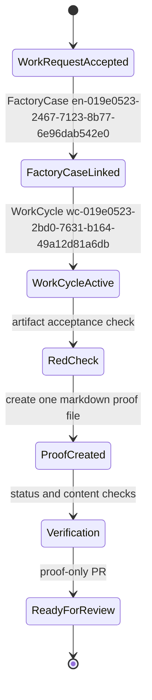

# ProofPacket: mac-mini PR production proof

## Summary

Dark factory PR-production proof for WorkRequest / legacy PatrolRequest `en-019e0521-fcf4-7563-a1b3-43b516382a2c`.

This worker prepared a reviewable proof-only PR artifact. No source, config, lockfile, entity spec, WASM integration, Cedar policy, trigger, or app module files were edited.

## Changed Files Map

| Path | Layer | Purpose |
| --- | --- | --- |
| `.proofs/mac-mini-pr-production-20260508T0109Z-en-019e0521-fcf4-7563-a1b3-43b516382a2c.md` | Proof artifact | Concise PR-production evidence packet |

## State Diagram



## Tests

| Step | Command | Result |
| --- | --- | --- |
| Red | `test -f .proofs/mac-mini-pr-production-20260508T0109Z-en-019e0521-fcf4-7563-a1b3-43b516382a2c.md && rg -q "ProofPacket" .proofs/mac-mini-pr-production-20260508T0109Z-en-019e0521-fcf4-7563-a1b3-43b516382a2c.md` | Failed as expected before implementation because the proof file did not exist. |
| Green | `test -f ... && rg -q 'ProofPacket' ... && rg -q '```mermaid' ... && rg -q 'Changed Files Map' ... && rg -q 'OData Links' ...` | Passed after implementation. |

## E2E Evidence

| Check | Evidence |
| --- | --- |
| Assigned worktree | `/Users/openclaw/Development/temperpaw-worktrees/codex-paw-patrol-16382a2c` |
| Initial `git status --short` | Clean; command produced no output before the proof artifact was created. |
| Post-change `git status --short` | `?? .proofs/mac-mini-pr-production-20260508T0109Z-en-019e0521-fcf4-7563-a1b3-43b516382a2c.md` |
| Runtime behavior | Not applicable: this request is proof-only and touches no executable behavior. |
| Temper-native orchestration | Preserved: no orchestration, trigger, entity spec, WASM integration, or Cedar policy changes were made. |

## Risk Notes

- Low risk: documentation-only proof artifact under `.proofs/`.
- No production behavior changed.
- No source, config, lockfile, generated app module, entity spec, WASM, trigger, or Cedar policy file was modified.

## OData Links

- WorkRequest / legacy PatrolRequest: `/odata/entities('en-019e0521-fcf4-7563-a1b3-43b516382a2c')`
- FactoryCase: `/odata/entities('en-019e0523-2467-7123-8b77-6e96dab542e0')`
- WorkCycle: `/odata/entities('wc-019e0523-2bd0-7631-b164-49a12d81a6db')`
