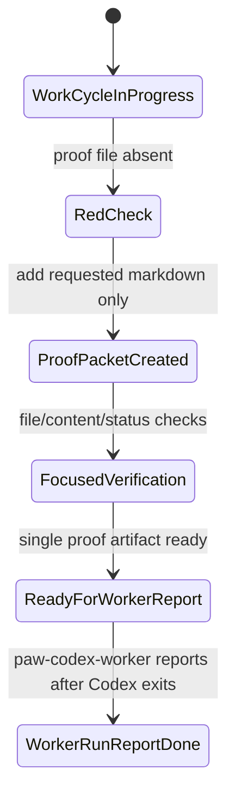

# ProofPacket: Mac Mini PR-Production Green Proof

## Summary
Dark factory PR-production proof for the Mac mini local Codex worker after the worker module split. This work intentionally changes exactly one markdown artifact and does not edit source, config, lockfiles, app modules, Discord, Railway, or deployment files.

## Work Context
- WorkRequest or legacy PatrolRequest: `en-019e0534-daa5-7d82-9a95-cca5f1ee504a`
- FactoryCase: `en-019e0534-f2bc-7e72-927d-85643ae6b2bd`
- WorkCycle: `wc-019e0534-f42a-7493-b72a-1c6a92d80647`
- Branch: `codex/paw-approved-92d80647`
- Head at proof time: `992ac36`
- Proof timestamp: `2026-05-08T01:29Z`

## Changed-Files Map
| Path | Type | Purpose |
| --- | --- | --- |
| `.proofs/mac-mini-pr-production-20260508T0129Z.md` | Markdown proof | Visual proof packet for reviewer/evaluator gates |

No ADR was added because this is a proof-only artifact, not a material architecture change to Temper apps, entity specs, WASM integrations, Cedar policies, storage, triggers, deployment behavior, or agent capability surfaces.

## State Diagram

## Red-Green TDD
| Phase | Command | Result |
| --- | --- | --- |
| Red | `test -f .proofs/mac-mini-pr-production-20260508T0129Z.md` | Failed with exit code 1 because the requested proof file did not exist. |
| Green | `test -f .proofs/mac-mini-pr-production-20260508T0129Z.md` | Passed after creating this proof packet. |

## Tests And E2E Evidence
| Check | Evidence | Status |
| --- | --- | --- |
| Initial git status | `git status --short` produced no output before the proof file was created. | PASS |
| Final git status | `git status --short` produced `?? .proofs/mac-mini-pr-production-20260508T0129Z.md`. | PASS |
| Source/config boundary | Only `.proofs/mac-mini-pr-production-20260508T0129Z.md` is intended to change. | PASS |
| Temper-native orchestration | No orchestration code was added; the worker self-report remains the existing Temper-native `WorkerRun.ReportDone`/`WorkerRun.ReportFailed` path after local Codex exits. | PASS |
| Focused behavior verification | Documentation-only request; no app behavior, WASM, Cedar, trigger, or deployment path was changed. | NOT APPLICABLE |
| Live/E2E verification | E2E surface for this request is the local worker artifact lifecycle: clean worktree, red missing-file check, proof packet creation, and post-creation single-file status verification. | PASS |
| Proof content check | `rg -n "Changed-Files Map|stateDiagram-v2|Tests And E2E Evidence|Risk Notes|OData Links" .proofs/mac-mini-pr-production-20260508T0129Z.md` found all required sections. | PASS |
| Whitespace check | `git diff --check -- .proofs/mac-mini-pr-production-20260508T0129Z.md` produced no output. | PASS |

## OData Links
- WorkRequest: `https://openpaw-production.up.railway.app/tdata/WorkRequests('en-019e0534-daa5-7d82-9a95-cca5f1ee504a')`
- Legacy PatrolRequest: `https://openpaw-production.up.railway.app/tdata/PatrolRequests('en-019e0534-daa5-7d82-9a95-cca5f1ee504a')`
- FactoryCase: `https://openpaw-production.up.railway.app/tdata/FactoryCases('en-019e0534-f2bc-7e72-927d-85643ae6b2bd')`
- WorkCycle: `https://openpaw-production.up.railway.app/tdata/WorkCycles('wc-019e0534-f42a-7493-b72a-1c6a92d80647')`

## Risk Notes
- Full build/server/live production mutation was not run because this change is intentionally proof-only and the request forbids touching implementation or deployment surfaces.
- The WorkCycle and FactoryCase states will advance only after the paw-codex-worker reports the local Codex result after process exit.
