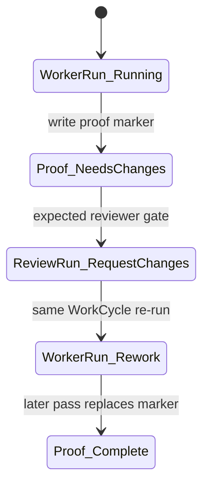

# ProofPacket: Mac Mini Review Rework Unhappy Path

## Status Marker
REVIEW_REWORK_STATUS: needs_changes

## Scope
This is the first implementation pass for the live Paw Patrol unhappy-path proof.
The requested behavior is intentionally incomplete so the independent reviewer can
request changes while the marker above remains `needs_changes`.

No source code, entity specs, config, lockfiles, deployment files, channel files,
or Discord files were edited. No ADR is required because this is a Markdown-only
proof artifact and does not change architecture, policy, runtime behavior, or
agent capability surfaces.

## Live Entities
| Entity | ID / Link | Observed State |
| --- | --- | --- |
| WorkRequest | [`en-019e056b-f5a9-7621-ba69-df33e6ddd98d`](https://openpaw-production.up.railway.app/tdata/WorkRequests('en-019e056b-f5a9-7621-ba69-df33e6ddd98d')) | Intake entity from request |
| FactoryCase | [`en-019e056c-00c7-7601-a9f8-05aaf04e3639`](https://openpaw-production.up.railway.app/tdata/FactoryCases('en-019e056c-00c7-7601-a9f8-05aaf04e3639')) | `InProgress` |
| WorkCycle | [`wc-019e056c-0189-7af3-ab94-68e854ce809f`](https://openpaw-production.up.railway.app/tdata/WorkCycles('wc-019e056c-0189-7af3-ab94-68e854ce809f')) | `InProgress` |
| WorkerRun | [`en-019e056c-0256-7653-a387-25114d67ad95`](https://openpaw-production.up.railway.app/tdata/WorkerRuns('en-019e056c-0256-7653-a387-25114d67ad95')) | `Running` on `mac-mini-codex-prod` |
| ReviewRun | Not available yet | Expected after this WorkerRun reports done |
| EvaluationRun | Not available yet | Expected only after review allows evaluation |
| PR | Not available yet | `gh pr view` reported no pull request for `codex/paw-patrol-e6ddd98d` |

## Changed Files Map
| File | Action | Reason |
| --- | --- | --- |
| `.proofs/mac-mini-review-rework-20260508T023021Z.md` | Added | First-pass proof packet with the required review-rework marker and visual state evidence |

## State Diagram


## Red-Green TDD
| Phase | Check | Result |
| --- | --- | --- |
| Red | `test -f .proofs/mac-mini-review-rework-20260508T023021Z.md` plus marker and Mermaid assertions before implementation | Failed because the proof file did not exist |
| Green | Same marker and Mermaid assertions after creating the proof | Passed: marker found on line 4, Mermaid fence found on line 33, and no completion marker found |

## Lightweight Verification
| Step | Command | Result |
| --- | --- | --- |
| Marker present | `rg -n '^REVIEW_REWORK_STATUS: needs_changes$' .proofs/mac-mini-review-rework-20260508T023021Z.md` | Passed with one match on line 4 |
| Completion marker absent | `awk '$0 == "REVIEW_REWORK_STATUS: " "fulfilled" {found=1} END {exit found}' .proofs/mac-mini-review-rework-20260508T023021Z.md` | Passed |
| Mermaid present | `rg -n '^```mermaid$' .proofs/mac-mini-review-rework-20260508T023021Z.md` | Passed with one match on line 33 |
| Scope guard | `git status --short` | Passed: only `?? .proofs/mac-mini-review-rework-20260508T023021Z.md` |
| Whitespace | `git diff --check -- .proofs/mac-mini-review-rework-20260508T023021Z.md` | Passed with no output |

## E2E Evidence
Authenticated read-only OData checks were run against production:

| Check | Evidence |
| --- | --- |
| WorkCycle read | `wc-019e056c-0189-7af3-ab94-68e854ce809f` returned `status: InProgress` and `implementer_worker_run_id: en-019e056c-0256-7653-a387-25114d67ad95` |
| FactoryCase read | `en-019e056c-00c7-7601-a9f8-05aaf04e3639` returned `status: InProgress` and linked this WorkCycle |
| WorkerRun read | `en-019e056c-0256-7653-a387-25114d67ad95` returned `status: Running`, branch `codex/paw-patrol-e6ddd98d`, and worker `mac-mini-codex-prod` |
| ReviewRun lookup | No ReviewRun exists yet for this first pass |
| EvaluationRun lookup | No EvaluationRun exists yet for this first pass |
| PR lookup | `gh pr view` returned `no pull requests found for branch "codex/paw-patrol-e6ddd98d"` |

## Risk Notes
- This proof is intentionally left in a reviewer-rework state. The independent
  reviewer should request changes while the status marker remains `needs_changes`.
- The next run of this same WorkCycle should update this same file on this same
  branch, replace the status marker with the completion marker, and add a line
  saying the reviewer-requested rework was completed.
- End-to-end server boot, source tests, and Discord/channel checks were not run
  because the requested scope is a Markdown-only proof change and explicitly
  forbids source, config, deployment, channel, and Discord edits.
