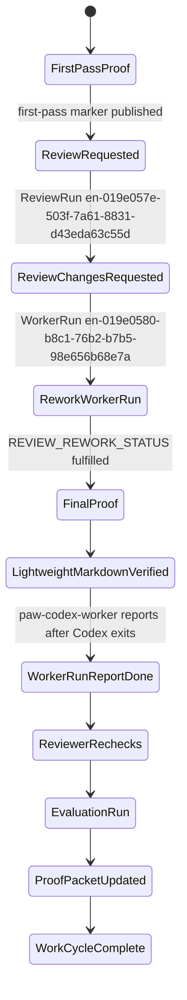

# Proof Report: Mac Mini Review Rework 2026-05-08T02:46:11Z

REVIEW_REWORK_STATUS: fulfilled

## Scope
This is the rework pass for the live Paw Patrol review-rework proof. The reviewer-requested rework was fulfilled.

Only this Markdown proof was updated:

| File | Change | Reason |
|------|--------|--------|
| `.proofs/mac-mini-review-rework-20260508T024611Z.md` | Updated | Replace the review-rework status marker, add the rework fulfillment sentence, and record final proof identifiers. |

No Temper entity specs, WASM integrations, Cedar policies, Rust code, scripts, or application files were changed. This proof-only rework is deliberately too small for an ADR because it does not alter architecture, state machines, authorization, deployment behavior, triggers, storage, provenance, or agent capability surfaces.

## Patrol Entities
| Entity | ID or Link | Status in this pass |
|--------|------------|---------------------|
| WorkRequest / legacy PatrolRequest | [`en-019e057a-7385-74a2-9a4a-2940052f3004`](https://openpaw-production.up.railway.app/tdata/PatrolRequests('en-019e057a-7385-74a2-9a4a-2940052f3004')) | Original request. |
| FactoryCase | [`en-019e057a-7cd5-75d3-84a1-f84a85014902`](https://openpaw-production.up.railway.app/tdata/FactoryCases('en-019e057a-7cd5-75d3-84a1-f84a85014902')) | Original factory case. |
| WorkCycle | [`wc-019e057a-7d87-7df1-b055-473ff30df4d3`](https://openpaw-production.up.railway.app/tdata/WorkCycles('wc-019e057a-7d87-7df1-b055-473ff30df4d3')) | InProgress during local rework verification. |
| WorkerRun ids | First pass: [`en-019e057a-7e44-77e3-a43d-47b572fab1ad`](https://openpaw-production.up.railway.app/tdata/WorkerRuns('en-019e057a-7e44-77e3-a43d-47b572fab1ad')); rework pass: [`en-019e0580-b8c1-76b2-b7b5-98e656b68e7a`](https://openpaw-production.up.railway.app/tdata/WorkerRuns('en-019e0580-b8c1-76b2-b7b5-98e656b68e7a')) | First pass is Done; rework pass was Running when queried before this local Codex exit. |
| ReviewRun ids | [`en-019e057e-503f-7a61-8831-d43eda63c55d`](https://openpaw-production.up.railway.app/tdata/ReviewRuns('en-019e057e-503f-7a61-8831-d43eda63c55d')) | ChangesRequested gate that triggered this rework. |
| EvaluationRun | [`en-019e057e-5106-7222-8d1c-835ce5be1dab`](https://openpaw-production.up.railway.app/tdata/EvaluationRuns('en-019e057e-5106-7222-8d1c-835ce5be1dab')) | Queued during local rework verification. |
| ProofPacket | [`en-019e057e-4f76-7321-b596-c1284eb49a26`](https://openpaw-production.up.railway.app/tdata/ProofPackets('en-019e057e-4f76-7321-b596-c1284eb49a26')) | First-pass proof packet was Rejected by the request-changes gate; this Markdown file is the updated proof source for the rework WorkerRun result. |
| Pull request | [PR #237](https://github.com/nerdsane/temperpaw/pull/237) | Existing open PR for branch `codex/paw-patrol-052f3004`. |

## State Diagram


## Verification
| Step | Command | Expected | Actual |
|------|---------|----------|--------|
| Red | `test -f .proofs/mac-mini-review-rework-20260508T024611Z.md && rg -q '^REVIEW_REWORK_STATUS: fulfilled$' .proofs/mac-mini-review-rework-20260508T024611Z.md && test "$(rg -c '^REVIEW_REWORK_STATUS:' .proofs/mac-mini-review-rework-20260508T024611Z.md)" -eq 1 && rg -q 'reviewer-requested rework was fulfilled' .proofs/mac-mini-review-rework-20260508T024611Z.md` | Fail before rework. | Failed with exit code 1 before this update because the final marker and fulfillment sentence were not both present. |
| Green | `test -f .proofs/mac-mini-review-rework-20260508T024611Z.md && rg -q '^REVIEW_REWORK_STATUS: fulfilled$' .proofs/mac-mini-review-rework-20260508T024611Z.md && test "$(rg -c '^REVIEW_REWORK_STATUS:' .proofs/mac-mini-review-rework-20260508T024611Z.md)" -eq 1 && rg -q 'reviewer-requested rework was fulfilled' .proofs/mac-mini-review-rework-20260508T024611Z.md` | Final marker exists exactly once and the required sentence is present. | Passed. |
| Markdown smoke | `rg -q '^```mermaid$' .proofs/mac-mini-review-rework-20260508T024611Z.md && rg -q '^## Verification$' .proofs/mac-mini-review-rework-20260508T024611Z.md && rg -q '^## E2E Evidence$' .proofs/mac-mini-review-rework-20260508T024611Z.md && rg -q '^## Risk Notes$' .proofs/mac-mini-review-rework-20260508T024611Z.md` | Mermaid fence and required sections are present. | Passed. |
| Diff whitespace | `git diff --check -- .proofs/mac-mini-review-rework-20260508T024611Z.md` | No whitespace errors. | Passed. |
| Scope guard | `git status --short && git diff --name-only` | Only `.proofs/mac-mini-review-rework-20260508T024611Z.md` is changed. | Passed. |

## E2E Evidence
This was a Markdown-only rework and did not touch runtime behavior, Temper apps, triggers, WASM integrations, policies, or Rust crates. The applicable live verification was lightweight proof verification plus entity lookup:

| Check | Evidence |
|-------|----------|
| Existing PR lookup | `gh pr view --json number,url,headRefName,state` returned open PR #237 for `codex/paw-patrol-052f3004`. |
| WorkCycle lookup | OData returned `Status=InProgress`, `reviewer_run_id=en-019e057e-503f-7a61-8831-d43eda63c55d`, `evaluation_run_id=en-019e057e-5106-7222-8d1c-835ce5be1dab`, and `implementer_worker_run_id=en-019e0580-b8c1-76b2-b7b5-98e656b68e7a`. |
| ReviewRun lookup | OData returned `Status=ChangesRequested` for `en-019e057e-503f-7a61-8831-d43eda63c55d`. |
| EvaluationRun lookup | OData returned `Status=Queued` for `en-019e057e-5106-7222-8d1c-835ce5be1dab`. |
| ProofPacket lookup | OData returned `Status=Rejected` for first-pass ProofPacket `en-019e057e-4f76-7321-b596-c1284eb49a26`, matching the review-rework gate. |

Full server boot, cargo test suites, and user-facing transport simulations were not run because the reviewer explicitly scoped this gate to lightweight Markdown and marker verification, and this rework changes only the proof file.

## Risk Notes
The remaining risk is limited to Patrol timing: the rework WorkerRun and any new proof packet are finalized by `paw-codex-worker` after this local Codex process exits. There is no application behavior risk from this rework because no executable code, Temper entity spec, WASM integration, Cedar policy, trigger, or deployment file changed.
