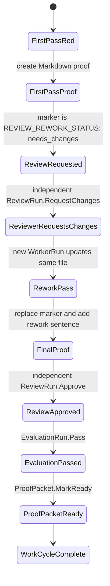

# Proof Report: Mac Mini Review Rework 2026-05-08T02:46:11Z

REVIEW_REWORK_STATUS: needs_changes

## Scope
This is the first pass for the live Paw Patrol review-rework proof. The only changed file is this Markdown proof:

| File | Change | Reason |
|------|--------|--------|
| `.proofs/mac-mini-review-rework-20260508T024611Z.md` | Added | Seed the live review-rework loop with a visible proof packet and a reviewer-trigger marker. |

No Temper entity specs, WASM integrations, Cedar policies, Rust code, scripts, or application files were changed. This proof-only change is deliberately too small for an ADR because it does not alter architecture, state machines, authorization, deployment behavior, triggers, storage, provenance, or agent capability surfaces.

## Patrol Entities
| Entity | ID or Link | Status in this pass |
|--------|------------|---------------------|
| WorkRequest / legacy PatrolRequest | [`en-019e057a-7385-74a2-9a4a-2940052f3004`](https://openpaw-production.up.railway.app/tdata/PatrolRequests('en-019e057a-7385-74a2-9a4a-2940052f3004')) | Provided by request. |
| FactoryCase | [`en-019e057a-7cd5-75d3-84a1-f84a85014902`](https://openpaw-production.up.railway.app/tdata/FactoryCases('en-019e057a-7cd5-75d3-84a1-f84a85014902')) | Provided by request. |
| WorkCycle | [`wc-019e057a-7d87-7df1-b055-473ff30df4d3`](https://openpaw-production.up.railway.app/tdata/WorkCycles('wc-019e057a-7d87-7df1-b055-473ff30df4d3')) | First implementation pass. |
| WorkerRun ids | Pending Patrol attachment after this local Codex process reports done. | Current local prompt did not expose a WorkerRun ID. |
| ReviewRun ids | Pending reviewer request-changes gate. | Expected next step while the marker remains `needs_changes`. |
| EvaluationRun | Pending final rework approval. | Not expected to run until review passes after rework. |
| ProofPacket | Pending final proof packet entity. | This Markdown file is the visual proof packet source for the loop. |
| Pull request | Pending branch publication. | No pull request URL was available in the local prompt or environment. |

## State Diagram


## Verification
| Step | Command | Expected | Actual |
|------|---------|----------|--------|
| Red | `test -f .proofs/mac-mini-review-rework-20260508T024611Z.md && rg -q 'REVIEW_REWORK_STATUS: needs_changes' .proofs/mac-mini-review-rework-20260508T024611Z.md && test "$(rg -c '^REVIEW_REWORK_STATUS:' .proofs/mac-mini-review-rework-20260508T024611Z.md)" -eq 1` | Fail before implementation. | Failed with exit code 1 because the file did not exist. |
| Green | `test -f .proofs/mac-mini-review-rework-20260508T024611Z.md && rg -q '^REVIEW_REWORK_STATUS: needs_changes$' .proofs/mac-mini-review-rework-20260508T024611Z.md && test "$(rg -c '^REVIEW_REWORK_STATUS:' .proofs/mac-mini-review-rework-20260508T024611Z.md)" -eq 1` | File exists, contains the needs-changes marker, and contains exactly one review-rework status marker. | Passed. |
| Marker guard | `! rg -q '^REVIEW_REWORK_STATUS: f[[:alpha:]_]*$' .proofs/mac-mini-review-rework-20260508T024611Z.md` | First pass does not contain the final status marker. | Passed. |
| Markdown smoke | `rg -q '^```mermaid$' .proofs/mac-mini-review-rework-20260508T024611Z.md && rg -q '^## Verification$' .proofs/mac-mini-review-rework-20260508T024611Z.md && rg -q '^## E2E Evidence$' .proofs/mac-mini-review-rework-20260508T024611Z.md && rg -q '^## Risk Notes$' .proofs/mac-mini-review-rework-20260508T024611Z.md` | Mermaid fence and required sections are present. | Passed. |
| Diff whitespace | `git diff --check -- .proofs/mac-mini-review-rework-20260508T024611Z.md` | No whitespace errors. | Passed. |

## E2E Evidence
This first pass intentionally leaves the proof in the reviewer-requested state so the live Patrol loop can create a ReviewRun and request changes before rework. The final rework pass must update this same file on the same branch, replace the marker, add the reviewer-requested rework sentence, and fill in any WorkerRun, ReviewRun, EvaluationRun, ProofPacket, and pull request identifiers that Patrol creates after this pass reports done.

## Risk Notes
The only risk in this pass is operational: if an external reviewer does not inspect the proof while the marker remains `needs_changes`, the rework loop will not be exercised. There is no code or architecture risk from this first pass because the work is limited to a single Markdown proof file.
