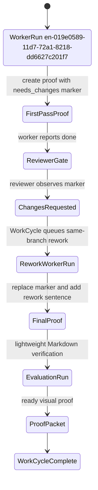
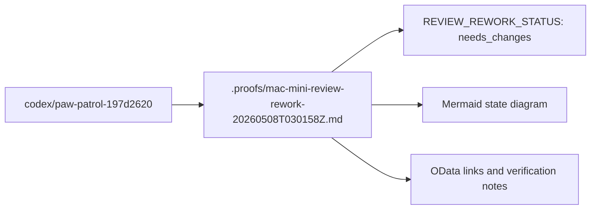

# Mac Mini Review-Rework Proof

REVIEW_REWORK_STATUS: needs_changes

## Scope

Proof-only first pass for the Paw Patrol review-rework loop after the worker pull request reuse fix.

Only this Markdown file is added:

```text
.proofs/mac-mini-review-rework-20260508T030158Z.md
```

No source code, entity spec, WASM integration, Cedar policy, config, lockfile, channel, Discord, Railway, or deployment file was changed.

## Live Entities

| Entity | ID | Status at first-pass authoring | OData |
| --- | --- | --- | --- |
| WorkRequest or legacy PatrolRequest | en-019e0588-e4d3-72f1-900a-d138197d2620 | Linked to this work | https://openpaw-production.up.railway.app/tdata/WorkRequests('en-019e0588-e4d3-72f1-900a-d138197d2620') |
| FactoryCase | en-019e0589-025d-7c60-8e9e-ee76785ccb66 | Linked to this work | https://openpaw-production.up.railway.app/tdata/FactoryCases('en-019e0589-025d-7c60-8e9e-ee76785ccb66') |
| WorkCycle | wc-019e0589-0acc-71f2-98c3-398685b5acf7 | InProgress | https://openpaw-production.up.railway.app/tdata/WorkCycles('wc-019e0589-0acc-71f2-98c3-398685b5acf7') |
| WorkerRun ids | first pass: en-019e0589-11d7-72a1-8218-dd6627c201f7; rework pass: pending reviewer gate | first pass Running during authoring | https://openpaw-production.up.railway.app/tdata/WorkerRuns('en-019e0589-11d7-72a1-8218-dd6627c201f7') |
| ReviewRun ids | pending | Queued after WorkerRun.ReportDone | pending OData entity |
| EvaluationRun | pending | Queued after WorkerRun.ReportDone and review gate | pending OData entity |
| ProofPacket | pending | Created by worker_run_lifecycle after WorkerRun.ReportDone | pending OData entity |
| Pull request | pending | Created or reused by paw-codex-worker after local Codex exits | pending GitHub URL |

## State Diagram



## Changed-Files Map



## Red-Green TDD

Red check was run before creating the file:

```text
if test -f .proofs/mac-mini-review-rework-20260508T030158Z.md; then
  unexpected file exists
else
  missing as expected
fi
```

Result: failed as expected because the proof file did not exist.

Green checks for this first pass verify:

```text
test -f .proofs/mac-mini-review-rework-20260508T030158Z.md
rg -n '^REVIEW_REWORK_STATUS: needs_changes$' .proofs/mac-mini-review-rework-20260508T030158Z.md
! rg -n '^REVIEW_REWORK_STATUS: fulfilled$' .proofs/mac-mini-review-rework-20260508T030158Z.md
rg -n '^```mermaid$' .proofs/mac-mini-review-rework-20260508T030158Z.md
git diff --check -- .proofs/mac-mini-review-rework-20260508T030158Z.md
```

First-pass verification results:

```text
marker present: line 3
completion marker present: no
Mermaid code fences present: lines 32 and 48
git diff --check: passed with no output
git status --short --branch:
## codex/paw-patrol-197d2620
?? .proofs/mac-mini-review-rework-20260508T030158Z.md
changed file scope:
.proofs/mac-mini-review-rework-20260508T030158Z.md
```

## E2E Evidence

This pass touched only a Markdown proof artifact, so no server boot, Discord flow, deployment, or WASM hot-load was relevant.

Live OData read-back during authoring confirmed:

```text
WorkCycle wc-019e0589-0acc-71f2-98c3-398685b5acf7: InProgress
WorkerRun en-019e0589-11d7-72a1-8218-dd6627c201f7: Running
Branch: codex/paw-patrol-197d2620
Worktree: /Users/openclaw/Development/temperpaw-worktrees/codex-paw-patrol-197d2620
```

The reviewer should request changes while the marker remains `needs_changes`, which exercises the Temper-native WorkCycle rework path before the second WorkerRun updates this same file on the same branch and pull request.

## Risk Notes

- Architecture: no material architecture change; no ADR required.
- Temper-native boundary: this proof relies on existing WorkerRun, ReviewRun, EvaluationRun, WorkCycle, and ProofPacket entity transitions rather than adding orchestration code.
- Residual first-pass risk: ReviewRun, EvaluationRun, ProofPacket, and pull request IDs are not available until paw-codex-worker reports this WorkerRun done and Patrol fans out the gates.
