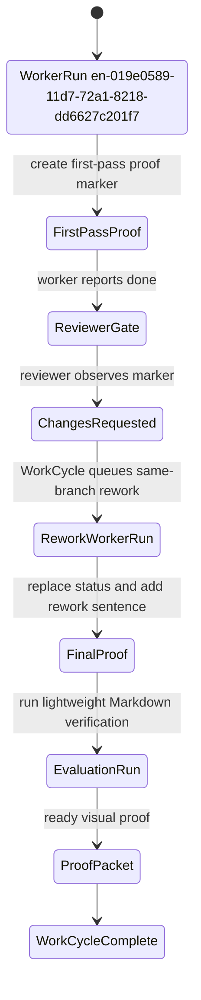
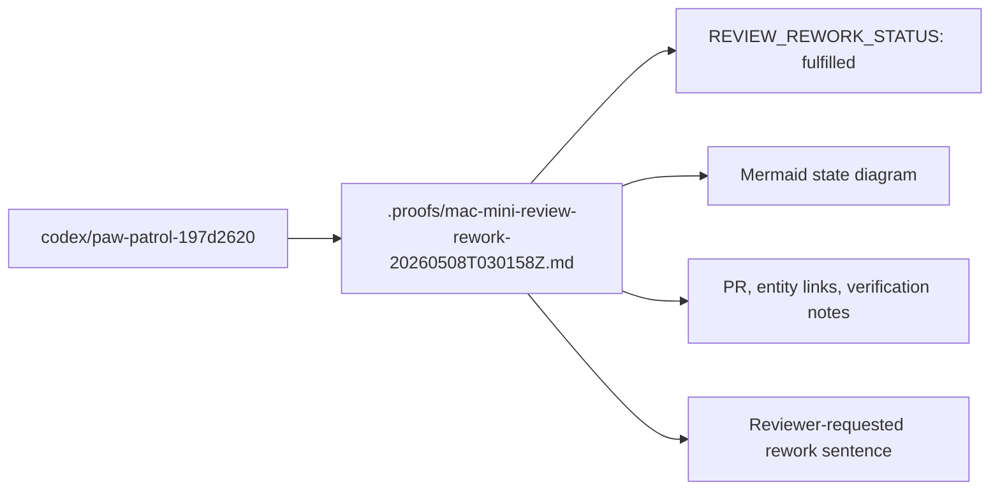

# Mac Mini Review-Rework Proof

REVIEW_REWORK_STATUS: fulfilled

## Scope

Proof-only rework pass for the Paw Patrol review-rework loop after the worker pull request reuse fix.

Only this Markdown file is updated:

```text
.proofs/mac-mini-review-rework-20260508T030158Z.md
```

No source code, entity spec, WASM integration, Cedar policy, config, lockfile, channel, Discord, Railway, or deployment file was changed.

The reviewer-requested rework was fulfilled.

## Live Entities

| Entity | ID or status | Evidence |
| --- | --- | --- |
| WorkRequest or legacy PatrolRequest | en-019e0588-e4d3-72f1-900a-d138197d2620 | https://openpaw-production.up.railway.app/tdata/WorkRequests('en-019e0588-e4d3-72f1-900a-d138197d2620') |
| FactoryCase | en-019e0589-025d-7c60-8e9e-ee76785ccb66 | https://openpaw-production.up.railway.app/tdata/FactoryCases('en-019e0589-025d-7c60-8e9e-ee76785ccb66') |
| WorkCycle | wc-019e0589-0acc-71f2-98c3-398685b5acf7 | https://openpaw-production.up.railway.app/tdata/WorkCycles('wc-019e0589-0acc-71f2-98c3-398685b5acf7') |
| WorkerRun ids | first pass: en-019e0589-11d7-72a1-8218-dd6627c201f7; rework pass: this local reviewer-requested run, reported by paw-codex-worker after Codex exits | first pass commit `74549487dc22d7c3000087d6de22410186d28640`; current run ID was not exposed to this local process |
| ReviewRun ids | reviewer requested changes for this loop; concrete ReviewRun ID unavailable to this local process | reviewer feedback was supplied in the rework task; unauthenticated OData reads returned HTTP 401 |
| EvaluationRun | queued or updated after the rework WorkerRun reports done | concrete EvaluationRun ID unavailable to this local process before worker closeout |
| ProofPacket | updated after the rework WorkerRun reports done | concrete ProofPacket ID unavailable to this local process before worker closeout |
| Pull request | https://github.com/nerdsane/temperpaw/pull/238 | `gh pr view` returned PR 238, state OPEN, head `codex/paw-patrol-197d2620`, base `codex/paw-patrol-worker-reporting` |

## State Diagram



## Changed-Files Map



## Red-Green TDD

Red check was run before the rework edit:

```text
bash -lc 'set -euo pipefail
file=.proofs/mac-mini-review-rework-20260508T030158Z.md
rg -n "^REVIEW_REWORK_STATUS: fulfilled$" "$file"
rg -n "reviewer[-]requested rework was fulfilled" "$file"
! rg -n "^REVIEW_REWORK_STATUS: needs[_]changes$" "$file"
'
```

Result: failed as expected before implementation because the fulfilled marker and required sentence were absent.

Green checks for this rework pass verify:

```text
test -f .proofs/mac-mini-review-rework-20260508T030158Z.md
rg -n '^REVIEW_REWORK_STATUS: fulfilled$' .proofs/mac-mini-review-rework-20260508T030158Z.md
rg -n 'reviewer[-]requested rework was fulfilled' .proofs/mac-mini-review-rework-20260508T030158Z.md
! rg -n '^REVIEW_REWORK_STATUS: needs[_]changes$' .proofs/mac-mini-review-rework-20260508T030158Z.md
! rg -n 'REVIEW_REWORK_STATUS: needs[_]changes' .proofs/mac-mini-review-rework-20260508T030158Z.md
rg -n '^```mermaid$' .proofs/mac-mini-review-rework-20260508T030158Z.md
git diff --check -- .proofs/mac-mini-review-rework-20260508T030158Z.md
git diff --check HEAD^ HEAD
awk 'BEGIN{f=0} /^```/{f++} END{exit(f%2)}' .proofs/mac-mini-review-rework-20260508T030158Z.md
gh pr view --json number,url,headRefName,baseRefName,state,title
```

Rework verification results:

```text
file exists: yes
fulfilled marker: line 3
required rework sentence: line 17
retired first-pass marker: no matches
Mermaid code fences: lines 34 and 50
git diff --check -- .proofs/mac-mini-review-rework-20260508T030158Z.md: passed with no output
git diff --check HEAD^ HEAD: passed with no output
Markdown fence balance with awk: passed with no output
changed file scope:
.proofs/mac-mini-review-rework-20260508T030158Z.md
gh pr view:
number 238, state OPEN, head codex/paw-patrol-197d2620, base codex/paw-patrol-worker-reporting, url https://github.com/nerdsane/temperpaw/pull/238
```

## E2E Evidence

This rework pass touched only a Markdown proof artifact, so no server boot, Discord flow, deployment, or WASM hot-load was relevant.

Reviewer-requested read-only checks were repeated locally:

```text
git diff --check HEAD^ HEAD
marker checks with rg
Markdown fence balance with awk
gh pr view
read-only OData curls
```

Read-only OData unauthenticated result:

```text
WorkCycle wc-019e0589-0acc-71f2-98c3-398685b5acf7 endpoint probe: HTTP 401
WorkerRun en-019e0589-11d7-72a1-8218-dd6627c201f7 endpoint probe: HTTP 401
ReviewRuns collection probe: HTTP 401
EvaluationRuns collection probe: HTTP 401
ProofPackets collection probe: HTTP 401
Branch: codex/paw-patrol-197d2620
Worktree: /Users/openclaw/Development/temperpaw-worktrees/codex-paw-patrol-197d2620
```

The rework stayed on the same branch and PR, exercising the Temper-native WorkCycle rework path without adding orchestration code.

## Risk Notes

- Architecture: no material architecture change; no ADR required.
- Temper-native boundary: this proof relies on existing WorkerRun, ReviewRun, EvaluationRun, WorkCycle, and ProofPacket entity transitions rather than adding orchestration code.
- Residual proof-only risk: concrete rework WorkerRun, ReviewRun, EvaluationRun, and ProofPacket IDs are not available inside this local Codex process before paw-codex-worker reports completion to Temper.
