# Paw Patrol Dark Factory Foundation Proof

Date: 2026-05-04

Updated: 2026-05-05

## Scope

Implemented the first Temper-native foundation slice for the Patrol-controlled
maintenance loop:

- `paw-patrol` core OS app with PatrolRequest, Signal, FactoryCase, WorkCycle,
  WorkerRun, ReviewRun, EvaluationRun, ProofPacket, RiskRule, RepoGraphSnapshot,
  QualityFinding, SecurityFinding, DailyBrief, and PatrolSchedule entity specs.
- Seeded initial explicit RiskRule floors for docs/proofs, WASM logic, Cedar
  policies, Discord/channel behavior, deploy/secrets/billing, and migrations.
- Seeded Patrol-owned webhook routes through `paw-ingest` for human/manager
  requests and machine signals: `patrol-request`, `patrol-signal`,
  `patrol-datadog`, `patrol-github`, and `patrol-discord`.
- Hardened `paw-ingest` so fresh boots explicitly build and install
  `validate_webhook`, `route_webhook`, and `process_webhook`. `process_webhook`
  now translates generic webhook payloads into typed `PatrolRequest.Submit` and
  `Signal.Ingest` parameters.
- Added `paw-codex-worker`, a Mac mini local Codex worker daemon that connects
  outbound to Temper event streams, claims only configured `local_codex`
  WorkerRuns, runs local Codex via ChatGPT/Codex auth when enabled, runs the
  built-in repo-health sweep for RepoGraphSnapshot work, and self-reports
  completion or failure through WorkerRun actions.
  On boot it catches already-queued WorkerRuns, requested repo-sweep ReviewRuns,
  and queued repo-sweep EvaluationRuns so stream interruptions do not strand
  low-risk repo-sweep gates.
  When `PAW_CODEX_ENABLE_EXECUTION=1`, it can also run a fresh local Codex
  reviewer pass for non-sweep ReviewRuns and run configured local evaluation
  commands from `PAW_CODEX_EVAL_COMMANDS`.
- Added `patrol_request_router`, a `paw-patrol` WASM integration triggered by
  `PatrolRequest.Submit`. It creates the paw-pm Issue, FactoryCase, WorkCycle,
  queued local WorkerRun, and records the PatrolRequest routing transitions.
- Added `signal_router`, a `paw-patrol` WASM integration triggered by
  `Signal.Ingest`. It normalizes Datadog/Discord/GitHub/schedule signals,
  archives obvious noise, or routes actionable failures into the same
  FactoryCase, paw-pm Issue, WorkCycle, and local WorkerRun path.
- Added `worker_run_lifecycle`, a `paw-patrol` WASM integration triggered by
  `WorkerRun.StartLocal`, `WorkerRun.ReportDone`, and `WorkerRun.ReportFailed`.
  It moves the case into work/review, queues an independent ReviewRun, queues an
  EvaluationRun, and creates or fills a visual ProofPacket draft before human
  review. ProofPacket drafts now include deterministic SVG data-URI visual
  summaries from structured proof fields.
- Added `work_cycle_lifecycle`, a `paw-patrol` WASM integration triggered by
  `WorkCycle.ApproveHumanStart`, `WorkCycle.ApproveHumanCompletion`, and
  `WorkCycle.Complete`. L3 work now pauses before any WorkerRun is queued, then
  pauses again after reviewer, evaluator, and ProofPacket gates pass until human
  completion approval arrives. Completed WorkCycles that came from accepted
  findings now resolve the source QualityFinding or SecurityFinding with proof,
  review, and evaluation links.
- Added `review_gate_lifecycle`, a `paw-patrol` WASM integration triggered by
  `ReviewRun.Approve`, `ReviewRun.RequestChanges`, `ReviewRun.Escalate`,
  `ReviewRun.Fail`, `EvaluationRun.Pass`, and `EvaluationRun.Fail`. It gates
  completion on independent review, automated evaluation, proof readiness, and
  L3 human-completion approval before a high-risk WorkCycle can complete.
- Added `repo_sweep_lifecycle`, a `paw-patrol` WASM integration triggered by
  `RepoGraphSnapshot.StartScan` and `RepoGraphSnapshot.ScanComplete`. It queues
  a local Codex repo-health sweep WorkerRun and turns structured sweep JSON into
  QualityFinding and SecurityFinding entities.
- Added `finding_lifecycle`, a `paw-patrol` WASM integration triggered by
  `QualityFinding.Accept` and `SecurityFinding.Accept`. It turns accepted
  findings into paw-pm Issues, WorkCycles, and queued local Codex WorkerRuns, or
  pauses L3 findings at human start approval before any worker can run.
- Added `daily_brief_lifecycle`, a `paw-patrol` WASM integration triggered by
  `DailyBrief.Start`. It renders a human-readable markdown rollup plus a
  deterministic SVG visual summary from WorkCycles, ProofPackets,
  QualityFindings, and SecurityFindings.
- Added `patrol_schedule_lifecycle`, a `paw-patrol` WASM integration triggered
  by `PatrolSchedule.Activate`, `PatrolSchedule.Resume`, and
  `PatrolSchedule.Trigger`. It computes `next_run_at`, uses Temper
  `schedule_at`, and creates RepoGraphSnapshot plus DailyBrief entities from
  recurring Patrol state transitions.
- Added `os-apps/paw-patrol/wasm/build.sh` so fresh local/Railway boots can
  build and load Patrol's bundled WASM modules under the existing startup
  policy.
- Added a launchd template and worker README for Mac mini operation, including
  required `WORKER_TOKEN`, `REPO_ROOT`, `CODEX_BIN`, execution toggle, boot-poll
  setting, and launchctl commands.
- Added `paw-codex-worker doctor`, a preflight command that checks repo paths,
  Codex CLI availability, OData reachability, event-stream reachability,
  worker token configuration, and execution safety before the daemon is loaded
  under `launchd`.
- Added `paw-codex-worker launchd-plist`, which renders a concrete launchd plist
  from the same environment used by `doctor`, including Railway URL, worker
  identity, worker token, repo/worktree paths, Codex binary, execution toggle,
  event polling, and optional evaluation commands.
- Hardened Patrol Cedar around worker and reviewer identity: `WorkerRun`
  self-report actions require the claiming worker principal to match
  `resource.WorkerId`, and `ReviewRun` review verdict actions require the
  reviewer principal to match `resource.ReviewerId` unless the caller is system,
  human, or supervisor.
- Fixed the underlying Temper Cedar resource-attribute path in the sibling
  Temper worktree `codex/cedar-resource-attrs`. Patrol policies rely on
  expressions like `principal.id == resource.worker_id`; Temper now places
  resource attributes on the Cedar resource entity, not only in request context.
  The fix is pushed at `557db7f30814801ad42d28e92725d007c6ce7732`, rebased on
  current Temper main, and TemperPaw is temporarily pinned to that portable git
  revision until the fix is merged into Temper mainline.
- Added a deterministic fake Codex fixture for E2E worker/reviewer/evaluator
  verification without API billing, plus a regression test that only reviewer
  prompts enter reviewer mode.
- Added a Patrol request risk-regression test and router layout that allows a
  plain native `cargo test` while still producing the `run` export in the WASM
  artifact. This caught and fixed the false L3 classification where "Produce a
  proof packet" matched the token `prod`.

## Current Usable Slice

- Patrol can accept human or machine intake through `PatrolRequest.Submit` and
  observable signals through `Signal.Ingest`.
- Patrol can accept HTTP webhook intake through `paw-ingest`:
  `/triggers/webhook/patrol-request` creates and submits a PatrolRequest, while
  `/triggers/webhook/patrol-signal`, `/patrol-datadog`, `/patrol-github`, and
  `/patrol-discord` create and ingest Signals.
- Patrol can create a repo-health sweep by creating a `RepoGraphSnapshot` and
  dispatching `StartScan`.
- Patrol can accept repo-health findings as actionable cleanup: accepting a
  QualityFinding or SecurityFinding creates a paw-pm Issue, WorkCycle, and
  queued local Codex WorkerRun. High-risk accepted findings use the same L3
  human start approval gate as requests and signals. Once the cleanup WorkCycle
  completes with reviewer, evaluator, and proof gates passed, Patrol resolves
  the source finding instead of leaving it stuck `InProgress`.
- The local `paw-codex-worker` can run as an outbound-only daemon, wake from the
  Temper event stream, claim configured `local_codex` work, run the repo scan,
  dispatch `RepoGraphSnapshot.ScanComplete`, and self-report
  `WorkerRun.ReportDone`.
- The local `paw-codex-worker` can also close the repo-sweep verification loop:
  it auto-reviews and auto-evaluates repo-sweep ReviewRuns/EvaluationRuns only.
- With `PAW_CODEX_ENABLE_EXECUTION=1`, the same daemon can run non-sweep code
  implementation, then launch a separate local Codex reviewer invocation that
  must return `VERDICT: approve`, `VERDICT: request_changes`, or
  `VERDICT: escalate`; after reviewer approval it runs deterministic local
  evaluation commands.
- `paw-codex-worker doctor` can be run with the same environment as launchd to
  catch missing Codex, broken Temper URL/token, bad repo paths, or event-stream
  issues before the worker claims production runs.
- `paw-codex-worker launchd-plist` can render the production Mac mini plist
  without hand-editing the static template.
- Patrol produces Drafting ProofPackets with visual SVG summaries after worker
  completion, then waits for ReviewRun and EvaluationRun gates before
  completion.
- L3 PatrolRequests and Signals are usable but intentionally gated:
  `patrol_request_router` and `signal_router` create the FactoryCase, paw-pm
  Issue, and WorkCycle, then leave the WorkCycle in
  `AwaitingHumanStartApproval` with no queued WorkerRun. `ApproveHumanStart`
  creates and queues the local Codex WorkerRun. After proof gates pass, the
  WorkCycle pauses in `AwaitingHumanCompletionApproval` until
  `ApproveHumanCompletion`.
- Patrol can render a DailyBrief with visual SVG summary and machine-readable
  arrays of completed work, proofs, and open risks.
- Patrol can run recurring sweep/brief schedules through `PatrolSchedule`.
  A scheduled trigger creates the repo sweep and daily brief, then the local
  worker can close the scheduled sweep through the same review/evaluation/proof
  loop.

## Visual Flow

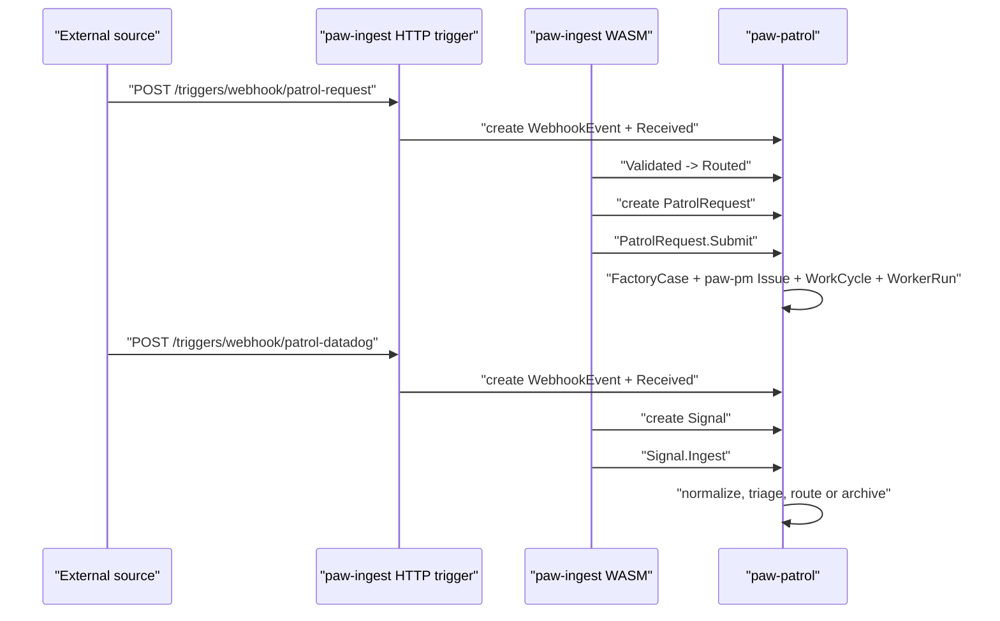

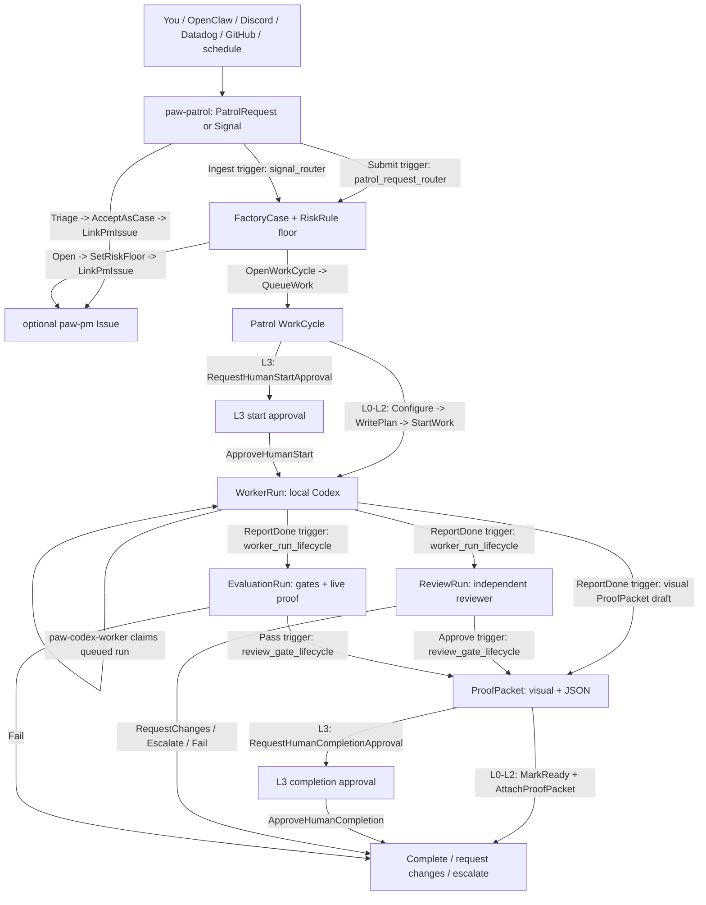

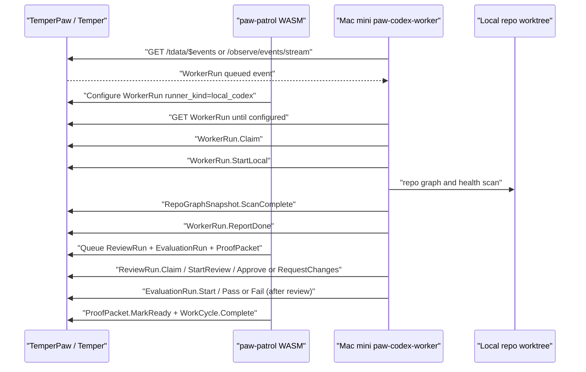

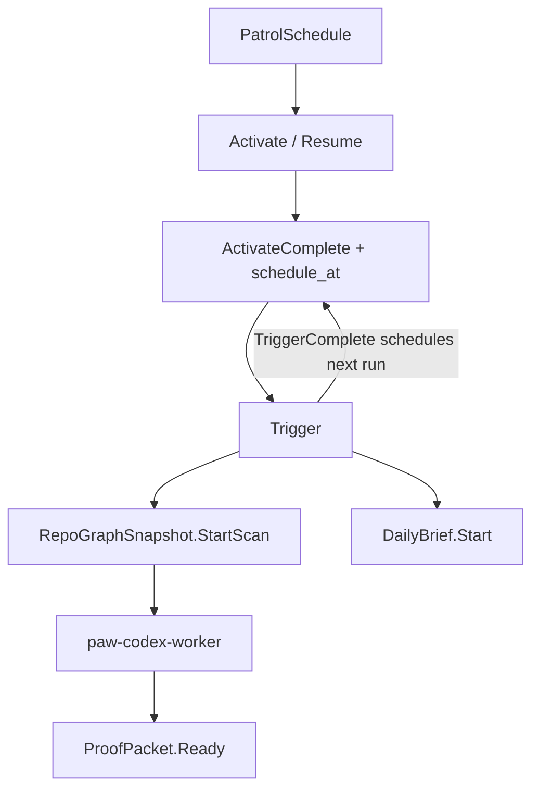

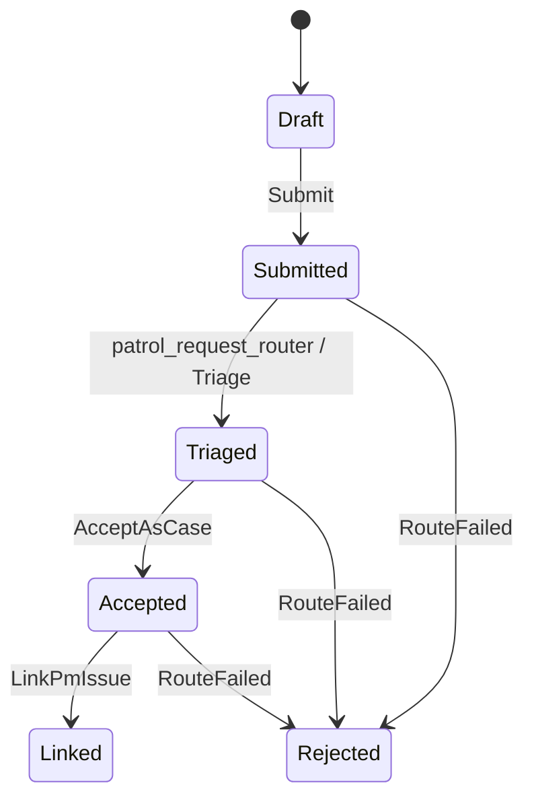

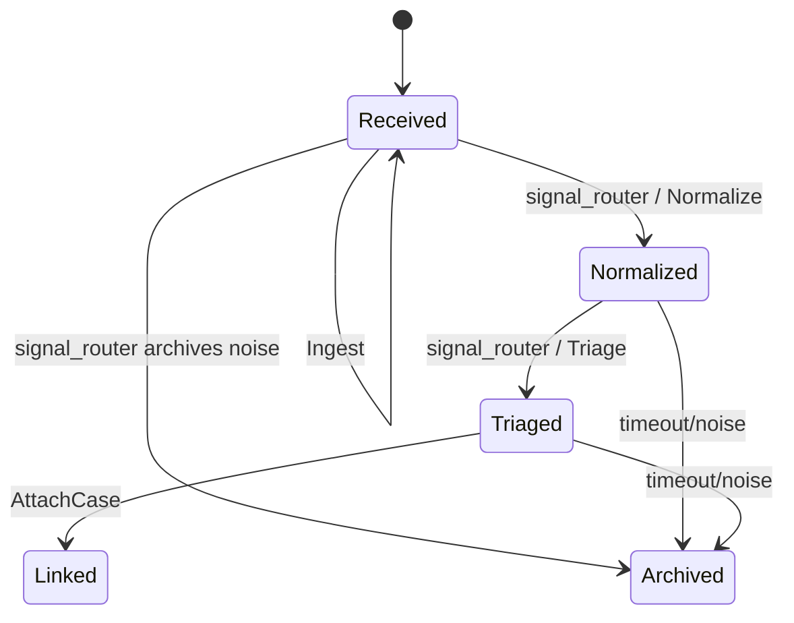

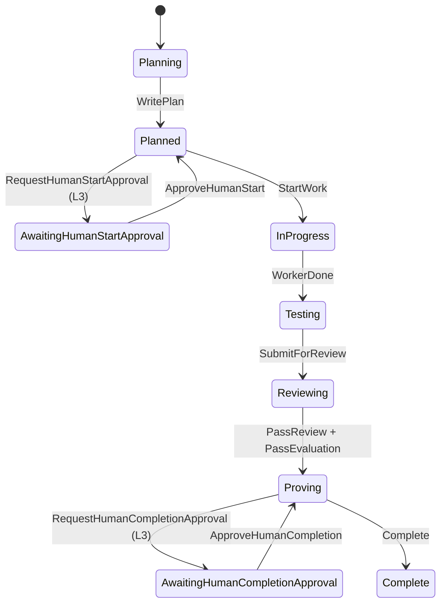

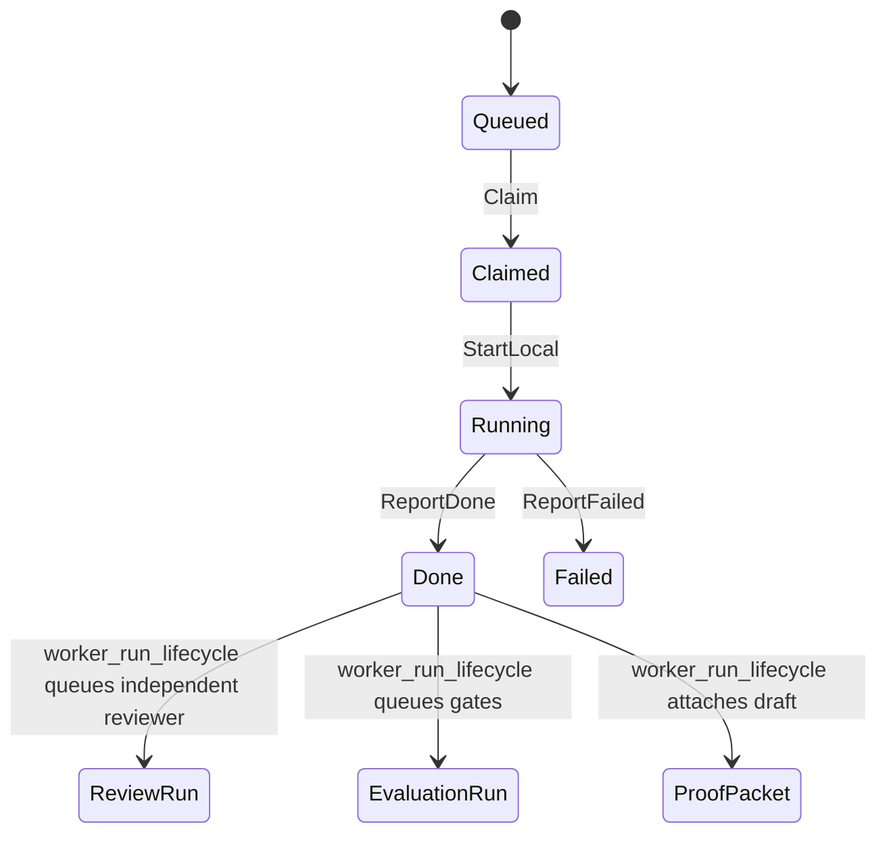

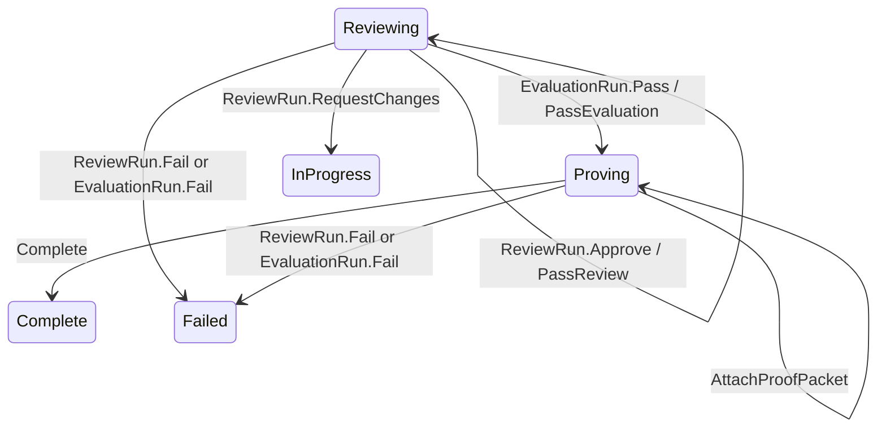

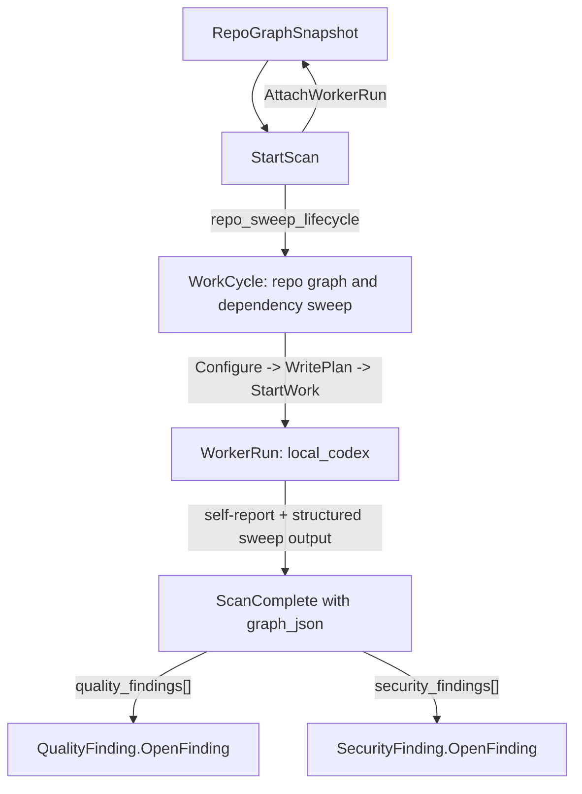

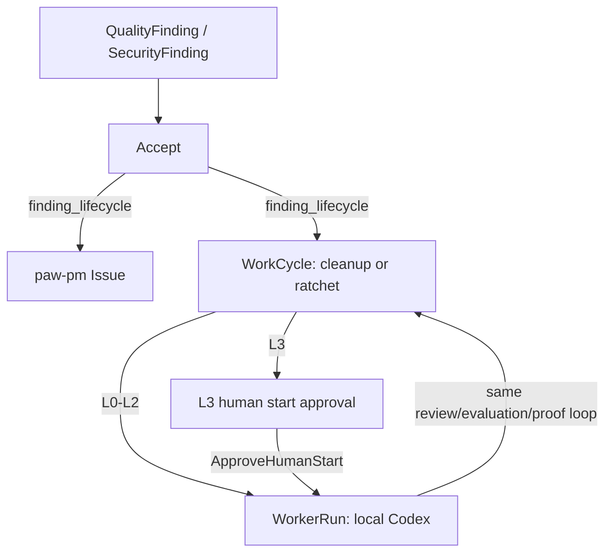

## Verification

Commands run:

```text
cargo test -p paw-codex-worker -- --nocapture
cargo test --manifest-path os-apps/paw-patrol/wasm/patrol_request_router/Cargo.toml -- --nocapture
cargo test -p temperpaw --test paw_patrol_foundation -- --nocapture
cargo test -p temperpaw startup_os_app -- --nocapture
cargo check -p paw-codex-worker
cargo check -p temperpaw -p paw-codex-worker
cargo build -p paw-codex-worker
cargo fmt --check --package paw-codex-worker --package temperpaw
cargo fmt --check
cargo clippy -p paw-codex-worker -- -D warnings
cargo run -p paw-codex-worker -- launchd-plist
./os-apps/paw-ingest/wasm/build.sh
./os-apps/paw-patrol/wasm/build.sh
cargo test -p temper-authz -- --nocapture  # sibling Temper worktree
cargo fmt --check  # os-apps/paw-ingest/wasm/process_webhook
cargo build --target wasm32-unknown-unknown --release  # patrol_request_router, standalone
cargo build --target wasm32-unknown-unknown --release  # signal_router, standalone
cargo build --target wasm32-unknown-unknown --release  # worker_run_lifecycle, standalone
cargo build --target wasm32-unknown-unknown --release  # finding_lifecycle, standalone
cargo build --target wasm32-unknown-unknown --release  # review_gate_lifecycle, standalone
cargo build --target wasm32-unknown-unknown --release  # repo_sweep_lifecycle, standalone
cargo build --target wasm32-unknown-unknown --release  # patrol_schedule_lifecycle, standalone
cargo build --target wasm32-unknown-unknown --release  # paw-ingest/process_webhook, standalone
cargo test -p temperpaw startup_os_app -- --nocapture
```

Local E2E exercised against a temporary local server:

```text
TEMPERPAW_WASM_STARTUP_POLICY=build PORT=3497 TEMPER_API_KEY=patrol-e2e PAW_TENANT=patrol_e2e cargo run -p temperpaw
POST /tdata/PatrolRequests
POST /tdata/PatrolRequests('{id}')/TemperPaw.Patrol.Submit
POST /tdata/Signals
POST /tdata/Signals('{id}')/TemperPaw.Patrol.Ingest
POST /tdata/WorkerRuns('{id}')/TemperPaw.Patrol.Claim
POST /tdata/WorkerRuns('{id}')/TemperPaw.Patrol.StartLocal
POST /tdata/WorkerRuns('{id}')/TemperPaw.Patrol.ReportDone
POST /tdata/ReviewRuns('{id}')/TemperPaw.Patrol.Claim
POST /tdata/ReviewRuns('{id}')/TemperPaw.Patrol.StartReview
POST /tdata/ReviewRuns('{id}')/TemperPaw.Patrol.Approve
POST /tdata/EvaluationRuns('{id}')/TemperPaw.Patrol.Start
POST /tdata/EvaluationRuns('{id}')/TemperPaw.Patrol.Pass
POST /tdata/RepoGraphSnapshots
POST /tdata/RepoGraphSnapshots('{id}')/TemperPaw.Patrol.StartScan
POST /tdata/RepoGraphSnapshots('{id}')/TemperPaw.Patrol.ScanComplete
POST /tdata/QualityFindings
POST /tdata/QualityFindings('{id}')/TemperPaw.Patrol.OpenFinding
POST /tdata/QualityFindings('{id}')/TemperPaw.Patrol.Accept
POST /tdata/DailyBriefs
POST /tdata/DailyBriefs('{id}')/TemperPaw.Patrol.Start
GET /tdata/DailyBriefs('{id}')
POST /tdata/PatrolSchedules
POST /tdata/PatrolSchedules('{id}')/TemperPaw.Patrol.Configure
POST /tdata/PatrolSchedules('{id}')/TemperPaw.Patrol.Activate
POST /tdata/PatrolSchedules('{id}')/TemperPaw.Patrol.Trigger
GET /tdata/PatrolSchedules('{id}')
POST /triggers/webhook/patrol-request
POST /triggers/webhook/patrol-datadog
GET /tdata/WebhookEvents
GET /tdata/FactoryCases('{id}')
GET /tdata/WorkCycles('{id}')
GET /tdata/ReviewRuns
GET /tdata/EvaluationRuns
GET /tdata/ProofPackets
GET /tdata/QualityFindings
GET /tdata/SecurityFindings
```

Observed result:

- Patrol foundation test: 18 passed.
- Worker unit tests: 17 passed.
- Patrol request router risk tests: 2 passed with plain native `cargo test`.
- Temper `temper-authz` platform suite: 54 passed.
- Worker crate compile/check/build: passed.
- Worker clippy with `-D warnings`: passed.
- Worker `launchd-plist` render smoke: passed.
- Mac mini worker launchd/README scaffold test: passed.
- Patrol request router WASM entry build exported `run` and kept native unit
  tests linkable.
- Patrol request router WASM release build: passed.
- Signal router WASM release build: passed.
- Worker run lifecycle WASM release build: passed.
- Work cycle lifecycle WASM release build: passed.
- Finding lifecycle WASM release build: passed.
- Review gate lifecycle WASM release build: passed.
- Repo sweep lifecycle WASM release build: passed.
- Daily brief lifecycle WASM release build: passed.
- Patrol schedule lifecycle WASM release build: passed.
- paw-ingest validate/route/process webhook WASM build script: passed.
- paw-ingest process_webhook standalone release build: passed.
- Formatting check: passed.
- Startup OS app tests: 2 passed.
- E2E request intake: PatrolRequest reached `Linked`; FactoryCase reached
  `Queued`; WorkerRun was queued with `runner_kind = local_codex`.
- E2E L3 request intake: PatrolRequest
  `en-019df5ec-6deb-78e1-920b-97025566bb56` reached `Linked`; FactoryCase
  `en-019df5ec-728a-7981-8a50-12507a6fa90b` reached `Scoped`; WorkCycle
  `wc-019df5ec-7295-7592-9781-56bd3d6c4ddd` reached
  `AwaitingHumanStartApproval`; no WorkerRun existed until
  `ApproveHumanStart`.
- E2E L3 human start approval: `ApproveHumanStart` moved the WorkCycle to
  `InProgress`, moved the FactoryCase to `Queued`, and created WorkerRun
  `en-019df5ed-6566-7740-9d2c-64502e193967` with `risk_lane = L3`,
  `runner_kind = local_codex`, and branch `codex/paw-approved-3d6c4ddd`.
- E2E webhook request intake: POST
  `/triggers/webhook/patrol-request` created WebhookEvent
  `en-019df5c9-eac9-7380-ae19-11a141f18613`, routed to
  PatrolRequest `en-019df5c9-ee01-7010-8249-e04a4c955ad9`, linked paw-pm Issue
  `is-019df5c9-f15c-7183-97b0-61c870444f70`, and created FactoryCase
  `en-019df5c9-f17f-7c70-bd6d-a233285190ff`.
- E2E signal intake: Datadog-like Signal reached `Linked`, created an L2
  FactoryCase, created a WorkCycle in `InProgress`, and queued a local Codex
  WorkerRun. A schedule `heartbeat ok` Signal reached `Archived` without
  creating work.
- E2E webhook signal intake: POST `/triggers/webhook/patrol-datadog` created
  WebhookEvent `en-019df5c9-eae1-7263-b5c4-7782eb1088ac`, routed to Signal
  `en-019df5c9-ee01-7010-8249-e05dc620b0bd` with `source = datadog` and
  `severity = error`, and linked FactoryCase
  `en-019df5c9-f174-79f1-9649-f60ae4d9d9d4`.
- E2E worker completion fan-out: WorkerRun reached `Done`; FactoryCase and
  WorkCycle reached `Reviewing`; ReviewRun reached `Requested`; EvaluationRun
  reached `Queued`; ProofPacket stayed `Drafting` with a Mermaid state diagram
  and residual risk text saying reviewer/evaluator have not passed yet. The
  ProofPacket also has a deterministic `data:image/svg+xml` visual summary URL.
- E2E review/evaluation gate closeout: ReviewRun reached `Approved`;
  EvaluationRun reached `Passed`; ProofPacket reached `Ready`; WorkCycle reached
  `Complete`; FactoryCase reached `Complete`; WorkCycle gate fields
  `review_passed`, `evaluation_passed`, and `proof_attached` were all `true`.
- E2E L3 completion gate: after WorkerRun `ReportDone`, ReviewRun
  `en-019df5ee-7a58-72f2-8034-2309021baf82` reached `Approved`,
  EvaluationRun `en-019df5ee-7a63-7170-af4c-1c92358ee991` reached `Passed`,
  and ProofPacket `en-019df5ee-7a4f-79c3-b0c5-d2c88cea5af9` reached `Ready`,
  the L3 WorkCycle paused at `AwaitingHumanCompletionApproval` instead of
  completing. `ApproveHumanCompletion` then completed both the WorkCycle and
  FactoryCase with `human_completion_approved = true`.
- E2E repo sweep queue: RepoGraphSnapshot reached `Scanning`; WorkCycle reached
  `InProgress`; WorkerRun reached `Queued` with `runner_kind = local_codex`,
  branch `codex/paw-repo-sweep-be632738`, and the assigned worktree under
  `/Users/seshendranalla/Development/temperpaw-worktrees/`.
- E2E repo sweep fanout: RepoGraphSnapshot reached `Ready`; ScanComplete opened
  one QualityFinding and one SecurityFinding from structured `graph_json`.
- E2E accepted finding cleanup queue: QualityFinding
  `en-019df5fe-08f7-72e2-8089-5af75edef462` reached `InProgress`, linked
  paw-pm Issue `is-019df5fe-0a2c-73f1-ba3d-953e30b9562e`, linked WorkCycle
  `wc-019df5fe-0a34-7643-b4f6-7e4f91494b4d`, and queued WorkerRun
  `en-019df5fe-0a24-7580-a95a-849386489c95` with `runner_kind = local_codex`,
  `risk_lane = L2`, branch `codex/paw-finding-qualityfinding-5edef462`, and an
  assigned worktree under `/Users/seshendranalla/Development/temperpaw-worktrees/`.
- E2E accepted finding closeout: QualityFinding
  `en-019df608-9d7f-7671-8767-10c76c3e1e69` reached `Resolved` after WorkCycle
  `wc-019df608-9eb8-7d62-a0af-125db00876b9` reached `Complete`. The WorkCycle
  carried `source_entity_type = QualityFinding` and
  `source_entity_id = en-019df608-9d7f-7671-8767-10c76c3e1e69`; its completion
  trigger resolved the finding with ProofPacket
  `en-019df608-a79d-7be1-aac1-a7263a4861a7`, ReviewRun
  `en-019df608-a7a6-73c1-bc36-e1a39da0e1cf`, and EvaluationRun
  `en-019df608-a7ad-75a2-b7bc-8393423d944b` in the resolution summary.
- E2E local worker boot-poll: `paw-codex-worker` claimed an already queued
  repo-sweep WorkerRun, ran the built-in repo-health scan, dispatched
  `RepoGraphSnapshot.ScanComplete`, self-reported `WorkerRun.ReportDone`, and
  opened 27 QualityFindings plus 20 SecurityFindings on the current worktree.
- E2E local worker event wake: with `PAW_CODEX_POLL_ON_START=0`, the rebuilt
  worker connected to the Temper event stream, observed the queued WorkerRun,
  waited for `runner_kind = local_codex`, claimed it, ran the repo scan, and
  moved RepoGraphSnapshot `en-019df5a5-40cb-7450-be7c-9013cc3dcdc3` to `Ready`
  with `finding_count = 47`.
- E2E repo-sweep review/evaluation closeout: with boot polling disabled, the
  worker moved RepoGraphSnapshot `en-019df5ab-7769-7ee1-8601-f3888b103555` to
  `Ready`, auto-approved ReviewRun `en-019df5ab-78e2-7d50-85ec-a8e254e8e742`,
  passed EvaluationRun `en-019df5ab-78e9-7101-a794-e9c85c0958c5`, marked
  ProofPacket `en-019df5ab-78db-7d53-8823-03b8d586ea7d` `Ready`, and completed
  WorkCycle `wc-019df5ab-778d-7e41-8921-d12b0ea27b9a`.
- E2E DailyBrief render: DailyBrief `en-019df59d-28e6-7921-a60f-4d6499d692ba`
  reached `Ready` and produced a markdown rollup plus a deterministic
  `data:image/svg+xml` visual summary URL.
- E2E PatrolSchedule recurrence: PatrolSchedule
  `en-019df5bb-44c7-74a2-b1bc-c5c5fa30f060` was configured with cadence `1h`,
  activated, manually triggered once, and stayed `Active` with
  `next_run_at = 2026-05-05T02:23:04Z`, `run_count = 1`,
  `last_repo_graph_snapshot_id = en-019df5bb-4810-74b0-9cc6-829380d1f00a`, and
  `last_daily_brief_id = en-019df5bb-4822-7a03-8bfa-dfa479840b58`.
- E2E scheduled repo-sweep closeout: the scheduled RepoGraphSnapshot
  `en-019df5bb-4810-74b0-9cc6-829380d1f00a` reached `Ready` with
  `finding_count = 47`; WorkCycle `wc-019df5bb-4c92-7e03-a341-b921035bcfb1`
  reached `Complete`; ProofPacket `en-019df5bb-d26c-7873-94c2-89696d2a79af`
  reached `Ready` with a visual SVG summary.
- Unit coverage for non-sweep code-change review/evaluation: local Codex review
  decisions require an explicit `VERDICT:` marker, missing verdicts escalate,
  and evaluation commands default to the Patrol foundation test unless
  `PAW_CODEX_EVAL_COMMANDS` is configured.
- Unit coverage for worker doctor: command parsing defaults to long-running
  `run`, accepts `doctor` and `--doctor`, warnings do not fail the preflight,
  and failures do fail it.
- E2E worker doctor smoke: against a temporary local server booted with
  `TEMPERPAW_WASM_STARTUP_POLICY=build`, `paw-codex-worker doctor` passed repo
  path checks, found `codex-cli 0.128.0`, confirmed `WORKER_TOKEN`, confirmed
  execution was disabled, and got `200 OK` from both
  `GET /tdata/$metadata` and `GET /tdata/$events`.
- Policy coverage: Patrol foundation tests assert that WorkerRun lifecycle
  actions are bound to `resource.WorkerId` and ReviewRun verdict actions are
  bound to `resource.ReviewerId`, with explicit human/supervisor/system escape
  hatches.
- Temper platform coverage: `test_resource_attribute_access_in_policy` proves
  an agent principal can satisfy Cedar ABAC through `resource.worker_id`, while
  a different worker principal is denied. This was required for Patrol workers
  to claim and start local runs under Cedar instead of relying on system bypass.

Final non-sweep local worker E2E smoke after the router WASM entry split:

```json
{
  "patrol_request": {
    "entity_id": "en-019df62c-8c26-7633-99a8-bef5db31d487",
    "status": "Linked",
    "risk_floor": "L1",
    "risk_evidence": "ordinary maintenance request"
  },
  "factory_case": {
    "entity_id": "en-019df62c-b0b6-7b21-b894-56ec85fb6118",
    "status": "Complete"
  },
  "work_cycle": {
    "entity_id": "wc-019df62c-b0cc-74f3-b0bc-f644a8dcc450",
    "status": "Complete",
    "review_passed": true,
    "evaluation_passed": true,
    "proof_attached": true
  },
  "worker_run": {
    "entity_id": "en-019df62c-b0e0-7fc0-8d80-a754efd9ef3e",
    "status": "Done",
    "worker_id": "fake-local-codex-smoke",
    "branch": "codex/paw-patrol-db31d487"
  },
  "review": {
    "entity_id": "en-019df62d-4aff-7f90-b57f-cb01591b1c04",
    "status": "Approved"
  },
  "evaluation": {
    "entity_id": "en-019df62d-4b1c-7681-97d6-7260277cbd59",
    "status": "Passed",
    "command": "test -f .paw-fake-codex-implementation"
  },
  "proof": {
    "entity_id": "en-019df62d-4ae4-7953-bea4-6e1c45c1f6d4",
    "status": "Ready",
    "visual_summary_url": "data:image/svg+xml,..."
  }
}
```

The smoke booted a fresh local TemperPaw server with
`TEMPERPAW_WASM_STARTUP_POLICY=build`, submitted a PatrolRequest, let
`paw-codex-worker` claim the queued local Codex WorkerRun via event/boot poll,
ran deterministic implementation/review/evaluation through the fake Codex
fixture, and observed the WorkCycle plus FactoryCase complete.

Final E2E entity summary:

```json
{
  "statuses": {
    "request": "Linked",
    "case": "Complete",
    "work_cycle": "Complete",
    "review": "Approved",
    "evaluation": "Passed",
    "proof": "Ready"
  },
  "gates": {
    "review_passed": "true",
    "evaluation_passed": "true",
    "proof_attached": "true"
  }
}
```

Final webhook intake E2E entity summary:

```json
{
  "webhook_events": [
    {
      "entity_id": "en-019df5c9-eac9-7380-ae19-11a141f18613",
      "route": "patrol-request",
      "target": "PatrolRequest",
      "action": "TemperPaw.Patrol.Submit"
    },
    {
      "entity_id": "en-019df5c9-eae1-7263-b5c4-7782eb1088ac",
      "route": "patrol-datadog",
      "target": "Signal",
      "action": "TemperPaw.Patrol.Ingest"
    }
  ],
  "patrol_request": {
    "entity_id": "en-019df5c9-ee01-7010-8249-e04a4c955ad9",
    "source": "manual-e2e",
    "requester_id": "codex-e2e",
    "factory_case_id": "en-019df5c9-f17f-7c70-bd6d-a233285190ff",
    "pm_issue_id": "is-019df5c9-f15c-7183-97b0-61c870444f70"
  },
  "signal": {
    "entity_id": "en-019df5c9-ee01-7010-8249-e05dc620b0bd",
    "source": "datadog",
    "severity": "error",
    "factory_case_id": "en-019df5c9-f174-79f1-9649-f60ae4d9d9d4"
  }
}
```

Final PatrolSchedule E2E entity summary:

```json
{
  "schedule": {
    "entity_id": "en-019df5bb-44c7-74a2-b1bc-c5c5fa30f060",
    "status": "Active",
    "run_count": 1,
    "next_run_at": "2026-05-05T02:23:04Z",
    "last_repo_graph_snapshot_id": "en-019df5bb-4810-74b0-9cc6-829380d1f00a",
    "last_daily_brief_id": "en-019df5bb-4822-7a03-8bfa-dfa479840b58"
  },
  "snapshot": {
    "entity_id": "en-019df5bb-4810-74b0-9cc6-829380d1f00a",
    "status": "Ready",
    "finding_count": "47"
  },
  "brief": {
    "entity_id": "en-019df5bb-4822-7a03-8bfa-dfa479840b58",
    "status": "Ready",
    "visual_summary_url": "data:image/svg+xml,..."
  },
  "work_cycle": {
    "entity_id": "wc-019df5bb-4c92-7e03-a341-b921035bcfb1",
    "status": "Complete",
    "review_passed": true,
    "evaluation_passed": true,
    "proof_attached": true
  }
}
```

Final Signal E2E entity summary:

```json
{
  "statuses": {
    "signal": "Linked",
    "case": "Queued",
    "work_cycle": "InProgress",
    "worker_run": "Queued"
  },
  "routing": {
    "risk_lane": "L2",
    "runner_kind": "local_codex",
    "noise_signal": "Archived"
  }
}
```

Final repo sweep E2E entity summary:

```json
{
  "snapshot": {
    "status": "Ready",
    "entity_id": "en-019df5ab-7769-7ee1-8601-f3888b103555",
    "commit_sha": "review-eval-e2e",
    "finding_count": "47"
  },
  "work_cycle": {
    "entity_id": "wc-019df5ab-778d-7e41-8921-d12b0ea27b9a",
    "status": "Complete",
    "review_passed": true,
    "evaluation_passed": true,
    "proof_attached": true
  },
  "worker": {
    "worker_run": "en-019df5ab-7794-7ba1-afab-ddd44351e58e",
    "status": "Done",
    "runner_kind": "local_codex",
    "worker_id": "mac-mini-codex-review-eval-e2e"
  },
  "findings": {
    "quality_count": 27,
    "security_count": 20
  },
  "proof": {
    "proof_packet_id": "en-019df5ab-78db-7d53-8823-03b8d586ea7d",
    "status": "Ready",
    "visual_summary_url": "data:image/svg+xml,..."
  }
}
```

The first E2E run caught a missing Patrol WASM `http_call` Cedar permit. That
policy is now included in `os-apps/paw-patrol/policies/patrol.cedar` for
`patrol_request_router`, `signal_router`, `worker_run_lifecycle`, and
`review_gate_lifecycle`, `repo_sweep_lifecycle`, `work_cycle_lifecycle`, and
`finding_lifecycle`.

## Remaining Work

This slice now establishes a usable local loop for Patrol intake, repo-health
sweeps, WorkerRun execution, visual proof drafts, and DailyBrief rendering. The
remaining production-hardening work is:

- Install and run `paw-codex-worker` under `launchd` on the actual Mac mini.
- Point production Datadog, Discord, and GitHub webhooks at the seeded Patrol
  ingest routes and configure secrets/signature validation per source.
- Merge the sibling Temper Cedar resource-attribute fix, then remove the
  temporary git-revision pin and return TemperPaw to the normal Temper mainline.
- Exercise the same non-sweep path against the real signed-in Mac mini Codex CLI
  before letting it touch production changes, then tune the default evaluation
  command set from early production runs.
- Harden risk-lane approval policies for high-risk paths, secrets, Cedar,
  migrations, deploy config, Discord behavior, and WASM changes.
- Ratchet cleaned areas so resolved quality/security findings cannot quietly
  regress.
