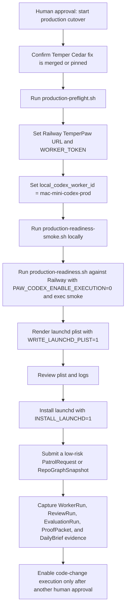

# Paw Patrol Production Cutover Runbook

This is the operator checklist for turning the local, verified `paw-patrol`
Dark Factory loop into the production Railway plus Mac mini loop. It does not
replace the smoke tests; it maps every remaining human approval or secret to a
gate and the evidence to capture.

## Cutover Map



## Inputs Required

| Input | Source | Why it is required |
| --- | --- | --- |
| Railway TemperPaw URL | Railway production service | The Mac mini worker connects outbound to production `/tdata/$events` and OData. |
| `WORKER_TOKEN` | Production Temper/Cedar operator | Authenticates the worker without exposing production database access. |
| `PATROL_OPERATOR_TOKEN` | Production Temper/Cedar operator | Lets the observe-only proof create a low-risk RepoGraphSnapshot and DailyBrief without using the worker credential for operator work. |
| `local_codex_worker_id` | TemperPaw secret/config | Must match `WORKER_ID=mac-mini-codex-prod` so Cedar can authorize `WorkerRun.Claim`. |
| Production Datadog webhook secret | Datadog/TemperPaw operator | Protects `/triggers/webhook/patrol-datadog`. |
| Production Discord webhook secret | Discord/TemperPaw operator | Protects `/triggers/webhook/patrol-discord`. |
| Production GitHub webhook secret | GitHub/TemperPaw operator | Protects `/triggers/webhook/patrol-github`. |
| Mac mini launchd approval | Human operator | Allows the always-on local worker to start and reconnect after reboot. |

## Gate 0: Dependency

Confirm the Temper Cedar resource-attribute fix is available to production
TemperPaw. Until the Temper PR is merged, TemperPaw may stay pinned to the
tested commit. Also confirm the TemperPaw PR that introduces Patrol itself is
merged, or that its clean/green head is explicitly approved for production
deployment before merge.

Evidence to capture:

```sh
git ls-remote --heads origin codex/cedar-resource-attrs
gh pr view 216 --repo nerdsane/temper --json url,headRefOid,mergeStateStatus,isDraft
gh pr view 218 --repo nerdsane/temperpaw --json url,headRefOid,mergeStateStatus,isDraft,statusCheckRollup
```

Pass condition: the Temper Cedar fix is merged, or TemperPaw production is
deployed from the PR revision that pins the tested Temper commit. If the pinned
revision is the approved production path, set `CONFIRM_TEMPER_PIN_OK=1` for
`production-preflight.sh` so that decision is captured in the proof. If
TemperPaw PR #218 is clean/green but unmerged and production may deploy that
head, set `CONFIRM_TEMPERPAW_PR_OK=1`; otherwise wait for the PR to merge.

## Gate 1: Production Preflight

Run the non-mutating preflight first. It records current machine/env readiness,
Railway link status, read-only Railway project/service candidates, launchd
status, webhook-secret presence, and remaining `human_blockers` without
changing Railway, launchd, or Temper.

```sh
crates/paw-codex-worker/scripts/production-preflight.sh
```

For final cutover, make blocked gates fail explicitly:

```sh
STRICT=1 \
TEMPER_URL=https://your-railway-temperpaw.example \
TEMPER_TENANT=default \
WORKER_ID=mac-mini-codex-prod \
WORKER_TOKEN="$TEMPER_WORKER_TOKEN" \
CONFIRM_LOCAL_CODEX_WORKER_ID=mac-mini-codex-prod \
CONFIRM_TEMPERPAW_PR_OK=1 \
crates/paw-codex-worker/scripts/production-preflight.sh
```

Evidence to capture:

- proof bundle path under `/tmp/paw-patrol-production-preflight-*`;
- `summary.json`;
- `proof.md`;
- `operator-handoff.md`;
- `gates.tsv`;
- `railway-candidates.json`;
- `human_blockers` list.

Pass condition: `summary.json.status` is `passed`, or every remaining
`human_blockers` item has an explicit operator decision before continuing.
If `railway:linked_project` is blocked, choose the intended project/service
from `railway-candidates.json` before running `railway link`.

When re-running preflight after making decisions, compare the old and new
summaries before continuing:

```sh
crates/paw-codex-worker/scripts/production-preflight-diff.sh \
  /tmp/previous-preflight/summary.json \
  /tmp/current-preflight/summary.json
```

Evidence to capture:

- `summary.json`;
- `proof.md`;
- `preflight-diff.svg`.

## Gate 2: Local Readiness Smoke

Run the guarded local production readiness smoke from a clean worktree. This
proves the release binary builds, doctor can reach OData and event streams, the
Codex exec-smoke path works, the launchd plist renders, and the fake token is
not printed.

```sh
crates/paw-codex-worker/scripts/production-readiness-smoke.sh
```

Evidence to capture:

- proof bundle path under `/tmp/paw-patrol-production-readiness-proof-*`;
- `summary.json`;
- `proof.md`;
- rendered plist path;
- confirmation that `codex_exec_smoke` is `doctor pass`;
- confirmation that `token_not_printed_to_readiness_log` is `true`.

Pass condition: the script exits 0 and prints `production readiness smoke
passed`.

## Gate 3: Railway Doctor

Run production readiness against Railway with execution disabled. This checks
the actual production URL/token path and local Codex auth/session without
letting the worker run code-change tasks.

```sh
TEMPER_URL=https://your-railway-temperpaw.example \
TEMPER_TENANT=default \
WORKER_ID=mac-mini-codex-prod \
WORKER_TOKEN="$TEMPER_WORKER_TOKEN" \
REPO_ROOT=/Users/seshendranalla/Development/temperpaw \
WORKSPACE_ROOT=/Users/seshendranalla/Development/temperpaw-worktrees \
CODEX_BIN=/Users/seshendranalla/.local/bin/codex \
PAW_CODEX_ENABLE_EXECUTION=0 \
PAW_CODEX_DOCTOR_EXEC_SMOKE=1 \
crates/paw-codex-worker/scripts/production-readiness.sh
```

Evidence to capture:

- `paw-codex-worker doctor` output;
- `[pass] worker_token`;
- `[pass] codex_bin`;
- `[pass] codex_exec_smoke`;
- `[pass] odata`;
- `[pass] event_stream`;
- no printed `WORKER_TOKEN` value.

Pass condition: `production readiness check passed`.

## Gate 4: Render And Review launchd

Render the exact launchd plist, then review it before loading anything.

```sh
WRITE_LAUNCHD_PLIST=1 \
INSTALL_LAUNCHD=0 \
TEMPER_URL=https://your-railway-temperpaw.example \
TEMPER_TENANT=default \
WORKER_ID=mac-mini-codex-prod \
WORKER_TOKEN="$TEMPER_WORKER_TOKEN" \
REPO_ROOT=/Users/seshendranalla/Development/temperpaw \
WORKSPACE_ROOT=/Users/seshendranalla/Development/temperpaw-worktrees \
CODEX_BIN=/Users/seshendranalla/.local/bin/codex \
PAW_CODEX_ENABLE_EXECUTION=0 \
PAW_CODEX_DOCTOR_EXEC_SMOKE=1 \
crates/paw-codex-worker/scripts/production-readiness.sh
```

Evidence to capture:

- rendered plist path;
- `TEMPER_URL`;
- `WORKER_ID`;
- `REPO_ROOT`;
- `WORKSPACE_ROOT`;
- `CODEX_BIN`;
- `PAW_CODEX_ENABLE_EXECUTION=0`;
- `PAW_CODEX_DOCTOR_EXEC_SMOKE=1`;
- `PAW_CODEX_POLL_ON_START=1`.

Pass condition: a human confirms the plist points at Railway, uses the expected
Mac mini checkout/worktree roots, and still keeps execution disabled.

## Gate 5: Install launchd

Install only after Gate 4 human approval.

```sh
WRITE_LAUNCHD_PLIST=1 \
INSTALL_LAUNCHD=1 \
TEMPER_URL=https://your-railway-temperpaw.example \
TEMPER_TENANT=default \
WORKER_ID=mac-mini-codex-prod \
WORKER_TOKEN="$TEMPER_WORKER_TOKEN" \
REPO_ROOT=/Users/seshendranalla/Development/temperpaw \
WORKSPACE_ROOT=/Users/seshendranalla/Development/temperpaw-worktrees \
CODEX_BIN=/Users/seshendranalla/.local/bin/codex \
PAW_CODEX_ENABLE_EXECUTION=0 \
PAW_CODEX_DOCTOR_EXEC_SMOKE=1 \
crates/paw-codex-worker/scripts/production-readiness.sh
```

Evidence to capture:

```sh
launchctl print gui/$(id -u)/com.temperpaw.paw-codex-worker
tail -200 /tmp/paw-codex-worker.out.log
tail -200 /tmp/paw-codex-worker.err.log
```

Pass condition: launchd shows the agent loaded, logs show the worker connected
to Railway `/tdata/$events`, and no production token is printed.

## Gate 6: Production Observe-Only Proof

With `PAW_CODEX_ENABLE_EXECUTION=0`, run the guarded observe-only proof script.
It creates a low-risk `RepoGraphSnapshot`, dispatches
`TemperPaw.Patrol.StartScan`, waits for the queued `WorkerRun` to be claimed by
`mac-mini-codex-prod`, waits for independent `ReviewRun` and `EvaluationRun`
passage, captures the final `ProofPacket`, and renders a `DailyBrief`.

The script refuses to create production entities unless `ALLOW_PRODUCTION_WRITE=1`
and the operator confirms launchd is still observe-only:

```sh
ALLOW_PRODUCTION_WRITE=1 \
CONFIRM_PAW_CODEX_ENABLE_EXECUTION_0=1 \
TEMPER_URL=https://your-railway-temperpaw.example \
TEMPER_TENANT=default \
PATROL_OPERATOR_TOKEN="$TEMPER_OPERATOR_TOKEN" \
EXPECTED_WORKER_ID=mac-mini-codex-prod \
crates/paw-codex-worker/scripts/production-observe-only.sh
```

Before production, prove the same gate locally with fake Codex:

```sh
crates/paw-codex-worker/scripts/production-observe-only-smoke.sh
```

Evidence to capture:

- proof bundle under `/tmp/paw-patrol-production-observe-only-*`;
- `summary.json`;
- `proof.md`;
- `observe-only.svg`;
- RepoGraphSnapshot entity link;
- WorkCycle link;
- WorkerRun link with `allowed_worker_id = mac-mini-codex-prod`;
- ReviewRun link;
- EvaluationRun link;
- ProofPacket link and visual proof;
- DailyBrief link if the test uses repo sweep or daily summary;
- worker logs around claim, review, evaluation, and self-report.

Pass condition: `summary.json.status` is `passed`, WorkerRun is `Done`,
ReviewRun is `Approved`, EvaluationRun is `Passed`, ProofPacket is `Ready`,
DailyBrief is `Ready`, and `worker.execution_enabled` is `false`.

## Gate 7: Webhook Secrets

Configure production Datadog, Discord, and GitHub webhook secrets on the
corresponding seeded routes:

- `/triggers/webhook/patrol-datadog`;
- `/triggers/webhook/patrol-discord`;
- `/triggers/webhook/patrol-github`;
- `/triggers/webhook/patrol-request`;
- `/triggers/webhook/patrol-signal`.

Evidence to capture:

- route config entity links;
- one Datadog Signal reaching `Linked`;
- one Discord Signal reaching `Linked`;
- one GitHub Signal reaching `Linked`;
- each WebhookEvent reaching `Processed`;
- proof bundle or screenshot of the Signal to WorkCycle link.

Pass condition: signed production webhooks create only `WebhookEvent` at the
trigger boundary, then Patrol routes real work through WASM state transitions.

## Gate 8: Enable Code-Change Execution

This requires a second human approval after observe-only production proof.

```sh
WRITE_LAUNCHD_PLIST=1 \
INSTALL_LAUNCHD=1 \
PAW_CODEX_ENABLE_EXECUTION=1 \
PAW_CODEX_EVAL_COMMANDS='cargo test --locked -p temperpaw --test paw_patrol_foundation -- --nocapture' \
TEMPER_URL=https://your-railway-temperpaw.example \
WORKER_TOKEN="$TEMPER_WORKER_TOKEN" \
crates/paw-codex-worker/scripts/production-readiness.sh
```

Pass condition: a low-risk code-change WorkCycle produces an implementer
WorkerRun, independent reviewer verdict, evaluation output, visual ProofPacket,
and no human review request unless the risk lane requires it.

## rollback

Stop the worker first. This does not mutate production Temper data; it only
stops the local executor from claiming more runs.

```sh
launchctl bootout gui/$(id -u) ~/Library/LaunchAgents/com.temperpaw.paw-codex-worker.plist
launchctl print gui/$(id -u)/com.temperpaw.paw-codex-worker || true
```

Then pause or revoke the worker identity/token in production TemperPaw. Leave
existing WorkerRuns visible in Patrol and dispatch the appropriate fail or
escalation action from Temper if a run was in progress.

## Done Criteria

Production cutover is complete only when all of these are true:

- Railway OData and `/tdata/$events` pass doctor with the real token;
- `codex exec` doctor smoke passes under the same Mac mini user/env launchd
  will use;
- launchd is installed and survives restart;
- the registered worker can claim only `allowed_worker_id =
  mac-mini-codex-prod` runs;
- observe-only production proof passed with `PAW_CODEX_ENABLE_EXECUTION=0`;
- Datadog, Discord, and GitHub signed webhook paths produce linked Signals;
- a DailyBrief is Ready with visual proof links;
- code-change execution was separately approved and produced a reviewed,
  evaluated, visual ProofPacket.
